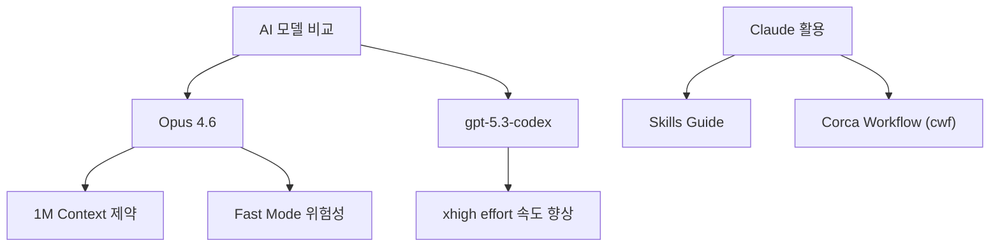

# [AI Learn & Unlearn] Opus 4.6 vs gpt-5.3-codex, The Complete Guide to Building Skills for Claude, co

> Source: https://www.stdy.blog/opus-46-codex-53-and-cwf/
> Lilys: https://lilys.ai/digest/8161944/9106521
> ExportedAt: 2026-03-06T16:52:59+00:00
> Category: AI/Agents

## Summary
- 최신 AI 모델인 Opus 4.6과 gpt-5.3-codex의 **실제 사용 후 성능 차이와 체감 속도**를 비교 분석합니다. 특히 1M 컨텍스트 지원의 현실적 제약과 고가 Fast Mode의 위험성 등, **실무자가 반드시 알아야 할 최신 기능의 장단점**을 명확히 알려드립니다. 더 나아가 Claude 스킬 빌딩 가이드
- <mark>Opus 4.6과 gpt-5.3-codex의 성능 체감 및 Claude 스킬 빌딩/워크플로우 구축 노하우를 공유한다.</mark>
- A["AI 모델 비교"] --> B["Opus 4.6"]

---

최신 AI 모델인 Opus 4.6과 gpt-5.3-codex의 **실제 사용 후 성능 차이와 체감 속도**를 비교 분석합니다. 특히 1M 컨텍스트 지원의 현실적 제약과 고가 Fast Mode의 위험성 등, **실무자가 반드시 알아야 할 최신 기능의 장단점**을 명확히 알려드립니다. 더 나아가 Claude 스킬 빌딩 가이드를 활용하고 자신만의 워크플로우를 구축하는 구체적인 노하우를 얻어 AI 활용 능력을 한 단계 업그레이드할 수 있습니다.

## 1. 최신 AI 모델 비교 및 Claude 스킬 빌딩 노하우
<mark>Opus 4.6과 gpt-5.3-codex의 성능 체감 및 Claude 스킬 빌딩/워크플로우 구축 노하우를 공유한다.</mark>

### 1.1. Opus 4.6 및 gpt-5.3-codex 사용 후기
1. **Opus 4.6 출시 및 초기 체감**
   1. 2월 6일 새벽에 출시되었으나, 아직 성능 향상에 대한 확실한 체감이 오지 않음
   2. 평소 작업으로 '바이브 체크'만 진행했기 때문일 수 있음
2. **gpt-5.3-codex의 체감 성능**
   1. 성능 자체는 차치하고, `xhigh effort` 모드의 속도가 확실히 빨라진 것을 체감함
   2. 소셜 미디어에서 좋은 평이 많아, 당분간 두 모델을 병행 사용할 예정임

### 1.2. Opus 4.6 주요 기능의 현실적 제약
1. **1M Context 지원의 아쉬움**
   1. 1백만 컨텍스트 지원으로 기대했으나, 현재는 API와 Pay-as-you-go에서만 가능하며 일반 사용 시 400 에러 발생
   2. 큰 작업을 여러 세션으로 나눌 때 발생하는 맥락 유실 문제를 해결하지 못해 아쉬움

2. **Fast Mode 사용 시 주의점**
   1. Fast mode는 정액제에 포함되지 않고 Pay-as-you-go 방식으로 작동함
   2. 짧은 두 세션 만에 보너스 $50이 거의 소모될 정도로 비용이 높음
   3. 속도 체감은 명확하지 않으므로, 사용 시 월별 지출 한도 설정이 필수적임

3. **Agent Team 기능의 만족도**
   1. 기존 서브에이전트 방식에서 벗어나 팀을 조직하여 상호 메시지 교환이 가능해짐
   2. 토큰 소모는 늘지만 더 지능적인 협업이 가능해진 느낌을 줌
   3. Agent Team 관련 버그 픽스가 많았으므로, 오토 업데이트를 하지 않았다면 최신 버전으로 업데이트해야 함

## 2. Claude 스킬 빌딩 및 Corca Workflow (cwf) 구축
<mark>앤트로픽의 공식 스킬 가이드를 활용하여 개인화된 워크플로우를 구축하는 과정을 설명한다.</mark>

### 2.1. The Complete Guide to Building Skills for Claude 활용
1. **가이드 문서 확보 및 변환**
   1. 앤트로픽에서 배포한 공식 스킬 가이드 PDF를 확인하고 기뻤음
   2. PDF를 마크다운으로 변환하고 에이전트 학습용으로 챕터별 분할 작업을 진행함
2. **공유 및 반응**
   1. 분할된 마크다운 문서를 공유했는데 사용자들의 반응이 좋았음
<a href="https://github.com/corca-ai/claude-plugins/blob/main/references/anthropic-skills-guide/README.md?ref=stdy.blog">

claude-plugins/references/anthropic-skills-guide/README.md at main · corca-ai/claude-plugins

Contribute to corca-ai/claude-plugins development by creating an account on GitHub.

corca-ai

</a>

### 2.2. cwf (Corca Workflow) 메이저 업그레이드
1. **업그레이드 배경 및 방향**
   1. 기존에 만든 스킬과 훅(hook)들이 산재되어 있어 통합의 필요성을 느낌
   2. Superpowers나 Compound Engineering Plugin처럼 단일 플러그인 + 멀티 스킬 구조로 워크플로우를 다루는 플러그인으로 메이저 업그레이드 중
   3. 이 과정에서 위에서 언급한 Complete Guide 문서를 참조함
2. **구축 철학 및 기대 사항**
   1. 1월 29일 글에서 언급했듯이, 외부 플러그인 사용보다 자신에게 맞는 워크플로우를 '자라나게' 하는 방식을 추구함
   2. 전체 워크플로우에 Agent Team 도입, 셀프 힐링 시스템, 린터, dspy 등 다양한 철학을 담아 구축 중임
   3. 작업이 거의 마무리 단계이며, 완료 후 공개 예정임

## Related
- [[코딩 1도 모르는 직장인을 위한 Claude Code 시작 가이드]]
- [[파일 넣으면 AI가 멍청해지는 이유]]
