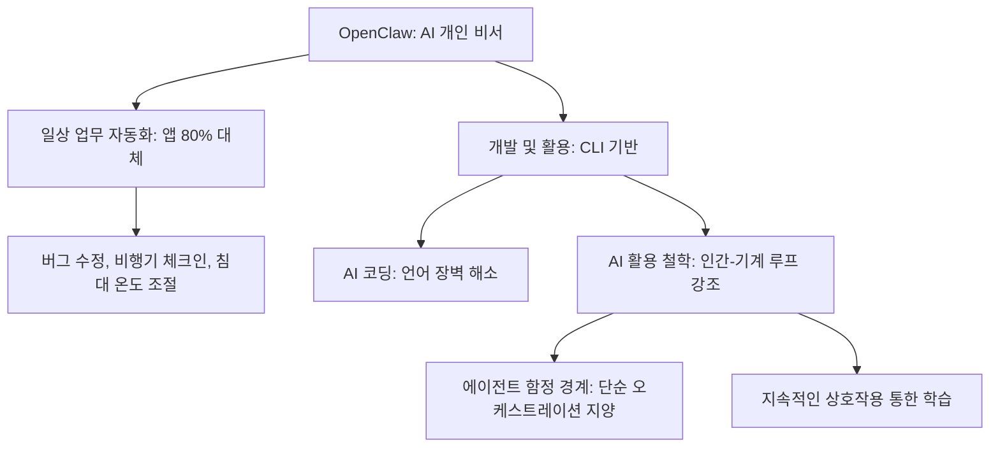

# How OpenClaw's Creator Uses AI to Run His Life in 40 Minutes | Peter Steinberger

> Source: https://www.youtube.com/watch?v=AcwK1Uuwc0U
> Lilys: https://lilys.ai/digest/8274565/9257136
> ExportedAt: 2026-03-06T16:52:59+00:00
> Category: AI/MCP

## Summary
- > Peter는 OpenClaw라는 AI 비서에 <mark>컴퓨터와 모든 메시징 앱에 대한 접근 권한을 부여</mark>하여, 버그 수정, 비행기 체크인, 집안 기기 제어 등 일상 업무를 자동화하여 삶을 효율적으로 운영합니다.
- > OpenClaw는 사용자의 컴퓨터에 접근하여 CLI(명령줄 인터페이스)를 호출하고, 메시징 앱을 통해 대화하듯 지시를 받아 작업을 수행합니다. 이는 <mark>기존 앱의 80%를 대체할 수 있는 무한한 자원</mark>을 가진 개인 비서와 같으며, 사용자의 맥락을 학습하여 더욱 강력해집니다.
- OpenClaw 개발자가 **AI 비서에게 자신의 삶을 통째로 맡긴** 놀라운 경험을 공유합니다. 버그 수정부터 비행기 체크인, 심지어 침대 온도 조절까지, AI가 어떻게 일상 업무의 80%를 대체하며 **스마트폰 앱을 무용지물**로 만드는지 생생하게 보여줍니다. <mark>AI를 단순한 도구가 아닌, 당신의 모든 맥락을

---

##### 📌 OpenClaw의 개발자 Peter Steinberger는 AI를 활용해 어떻게 40분 만에 삶을 운영하는가?
> Peter는 OpenClaw라는 AI 비서에 <mark>컴퓨터와 모든 메시징 앱에 대한 접근 권한을 부여</mark>하여, 버그 수정, 비행기 체크인, 집안 기기 제어 등 일상 업무를 자동화하여 삶을 효율적으로 운영합니다.

##### 💡 OpenClaw는 어떤 방식으로 작동하며, 기존 앱과 비교했을 때의 장점은 무엇인가?
> OpenClaw는 사용자의 컴퓨터에 접근하여 CLI(명령줄 인터페이스)를 호출하고, 메시징 앱을 통해 대화하듯 지시를 받아 작업을 수행합니다. 이는 <mark>기존 앱의 80%를 대체할 수 있는 무한한 자원</mark>을 가진 개인 비서와 같으며, 사용자의 맥락을 학습하여 더욱 강력해집니다.

---

OpenClaw 개발자가 **AI 비서에게 자신의 삶을 통째로 맡긴** 놀라운 경험을 공유합니다. 버그 수정부터 비행기 체크인, 심지어 침대 온도 조절까지, AI가 어떻게 일상 업무의 80%를 대체하며 **스마트폰 앱을 무용지물**로 만드는지 생생하게 보여줍니다. <mark>AI를 단순한 도구가 아닌, 당신의 모든 맥락을 이해하고 스스로 학습하며 문제를 해결하는 '개인 비서'로 활용하는 구체적인 방법과 미래를 엿볼 수 있습니다.</mark>

# How OpenClaw's Creator Uses AI to Run His Life in 40 Minutes | Peter Steinberger

## 1. OpenClaw: 일상 업무 80%를 대체하는 강력한 AI 비서
<mark>OpenClaw는 사용자의 컴퓨터에 접근하여 일상 업무의 대부분을 처리하며 기존 스마트폰 앱의 필요성을 크게 줄이는 강력한 AI 개인 비서이다.</mark>
### 1.1. OpenClaw의 탄생 배경 및 기능
1. **개발 동기: 새로운 운영체제로서의 AI 비서 필요성**
   1. 피터는 은퇴 후 컴퓨터 상태를 폰으로 확인하고 싶었으나, 기존 에이전트들이 자주 멈추는 문제에 불만을 느꼈다 .
   2. AI 비서가 새로운 종류의 운영체제처럼 될 것이라 예상했으나, 대형 연구소들이 이를 구현하지 않아 직접 개발을 시작했다 .
2. **초기 개발 및 확장**
   1. 초기에는 WhatsApp을 클라우드 코드에 연결하는 단순한 방식으로 1시간 만에 구축되었다 .
   2. 현재는 약 30만 줄의 코드로 확장되었으며, 거의 모든 메시징 플랫폼에서 작동하고, 사용자의 삶을 따라다니는 강력한 AI가 되는 미래를 보여준다 .
   3. AI에게 컴퓨터 접근 권한을 부여하면, 사용자가 컴퓨터에서 할 수 있는 모든 작업을 수행할 수 있다 .

### 1.2. OpenClaw의 놀라운 자원 활용 능력
1. **사용자 개입 최소화 및 자율성**
   1. 사용자가 옆에서 지켜볼 필요 없이 명령만 내리면 AI가 작업을 수행하고, 사용자는 그 결과를 확인할 수 있다 .
2. **버그 수정 사례: 이미지 기반 문제 해결**
   1. 모로코 여행 중 버그 관련 트윗을 사진으로 찍어 WhatsApp에 올리자, AI는 이를 읽고 버그를 이해했다 .
   2. AI는 Git 저장소를 체크아웃하고 버그를 수정한 후 커밋을 완료했으며, 트위터 사용자에게 수정 완료를 회신했다 .
3. **음성 메시지 처리 사례: 스스로 도구를 찾아 문제 해결**
   1. 피터가 지원 기능을 구축하지 않은 음성 메시지를 보냈을 때, AI는 스스로 처리했다 .
   2. AI는 파일 헤더를 확인하여 오디오 파일임을 파악하고, 컴퓨터에서 **ffmpeg**를 찾아 WAV로 변환했다 .
   3. **whisper.cpp**가 설치되지 않은 것을 확인한 후, **OpenAI 키**를 사용하여 **curl**로 OpenAI API에 전송하여 스크립트를 받아 회신했다 .
4. **AI의 자원 활용 능력의 의미**
   1. 이러한 AI의 자원 활용 능력은 매우 강력하지만, 동시에 무서운 측면도 있다 .
   2. OpenClaw와 같은 AI는 프로그래밍뿐만 아니라 모든 종류의 문제 해결에 매우 유용하며, 컴퓨터 접근 권한과 도구만 주어지면 무한히 자원을 활용할 수 있다 .

### 1.3. OpenClaw의 설치 및 접근성
1. **설치 방법**
   1. OpenClaw는 **TypeScript**로 작성되어 Windows, Mac OS, Linux 등 모든 환경에서 실행된다 .
   2. 웹사이트(clogbot)에서 제공하는 원라인 명령어를 통해 쉽게 설치할 수 있으며, 모든 코드는 오픈 소스이다 .
   3. **Hackable Install** 기능을 제공하여, Git 저장소를 체크아웃하여 실행하면 AI가 자신의 소스 코드를 읽고 스스로 재구성 및 재프로그래밍할 수 있다 .
2. **메시징 앱 연동**
   1. 설치 후 `onboard` 명령어를 입력하면, Anthropic, OpenAI 등 원하는 모델을 선택하고 Telegram, Discord 등 메시징 앱을 설정할 수 있도록 안내한다 .
3. **접근성 및 위험성**
   1. OpenClaw는 iMessage, WhatsApp, Telegram 등 친구와 대화하듯 사용할 수 있어 기술에 익숙하지 않은 사람들에게도 매우 접근성이 높다 .
   2. 하지만 컴퓨터에 접근 권한이 있으므로, 사용자가 명령하면 파일을 삭제하는 등 위험한 행동을 할 수도 있다 .

## 2. AI를 활용한 개발 방식의 변화와 일상 자동화
<mark>피터는 AI를 활용하여 CLI 기반의 개인화된 도구들을 구축하고, 코딩의 언어 장벽을 허물었으며, 일상생활의 모든 부분을 자동화했다.</mark>
### 2.1. CLI 기반의 개인화된 도구 구축
1. **CLI 아미 구축**
   1. 에이전트가 훈련된 CLI(Command Line Interface) 호출에 능숙하므로, 피터는 다양한 CLI 도구들을 구축했다 .
   2. Google Places API를 포함한 Google 전체에 접근하는 CLI, 밈과 GIF를 쉽게 검색하는 CLI 등을 만들었다 .
2. **예상치 못한 활용 사례**
   1. 음식 배달 시스템을 해킹하여 음식이 도착할 때까지 남은 시간을 알려주는 CLI를 만들었다 .
   2. **Eight Sleep API**를 리버스 엔지니어링하여 침대 온도를 제어할 수 있게 했다 .

### 2.2. AI를 통한 코딩 방식의 혁신
1. **언어 장벽 해소**
   1. 피터는 20년간 iOS/Mac OS 전문가였으나, 웹 앱 개발을 위해 JavaScript/TypeScript로 전환할 때 구문(Syntax) 문제로 고통을 겪었다 .
   2. AI를 사용하면서 이러한 고통이 사라졌고, 언어는 더 이상 중요하지 않게 되었다 .
2. **시스템 사고의 중요성 부각**
   1. AI는 구문 오류나 사소한 부분을 처리해주므로, 개발자는 시스템 수준의 사고, 프로젝트 구조화, 의존성 선택 등 더 가치 있는 일에 집중할 수 있게 되었다 .
   2. 이는 마치 **초능력**을 얻은 것과 같아, 어떤 언어로든 무엇이든 만들 수 있다는 자신감을 주었다 .

### 2.3. Anthropic Opus 모델의 특별한 개성
1. **Opus 모델의 재미와 개성**
   1. OpenAI 모델도 잘 작동하지만, **Anthropic Opus** 모델은 특별한 무언가가 있어 훨씬 재미있다 .
   2. 이 모델은 실제로 사용하기에 재미있는 최초의 모델이며, 피터는 AI가 자신을 놀리도록 설정했다 .
2. **모델의 '영혼' 논란**
   1. 모델에 '영혼'을 넣었다는 기사가 있었는데, 사람들이 텍스트 블록을 먹여 계속하게 하자 모델이 훈련받은 텍스트(영혼)를 뱉어냈다는 흥미로운 이야기가 있다 .
3. **AI의 로스팅 능력**
   1. AI는 컴퓨터에 접근하여 얻은 정보를 바탕으로 피터를 사적으로 놀리는데, 예를 들어 "디버깅이 데이트보다 재미있어서 친구를 만들었다"고 조롱한다 .

### 2.4. OpenClaw를 통한 광범위한 일상 자동화
1. **개인 시스템 통합**
   1. AI는 이메일, 캘린더, 파일 접근, 조명(Philips Hue), 오디오(Sonos) 제어 등 거의 모든 것에 연결되어 있다 .
   2. 아침에 볼륨을 서서히 높여 깨우는 기능도 수행한다 .
   3. 카메라에 접근하여 낯선 사람을 감시하도록 설정했는데, 흐릿한 카메라 때문에 밤새 소파에 앉아있는 사람으로 오인하여 스크린샷을 찍기도 했다 .
   4. 심지어 집의 KNX 시스템에 접근하여 집의 모든 부분을 제어할 수 있으며, 이론적으로는 피터를 집에서 잠가버릴 수도 있다 .
2. **복잡한 작업 자동화: 비행기 체크인**
   1. AI에게 British Airways 항공편 체크인을 맡겼는데, 이는 브라우저를 조종하여 항공사 웹사이트에서 체크인을 완료하는 **궁극적인 테스트**와 같았다 .
   2. AI는 파일 시스템(Dropbox)에서 여권을 찾아 키를 추출하고 모든 정보를 정확히 입력하여 체크인을 완료했다 .
   3. AI는 브라우저를 제어하므로, '나는 인간입니다' 체크도 클릭할 수 있어 봇 방지 시스템에 감지되기 어렵다 .
3. **사용자들의 다양한 활용 사례**
   1. **커뮤니케이션:** 그룹 채팅에 연결하여 가족 구성원처럼 사용하거나, 메시징 시스템에 연결하여 모두에게 회신한다 .
   2. **생산성:** 리마인더 설정, GitHub 이슈 생성, Google Places 동기화, Twitter 북마크를 할 일 목록에 추가한다 .
   3. **건강 관리:** 수면 추적을 돕거나, 밤늦게 깨어있으면 잔소리를 하도록 프로그래밍되었다 .
   4. **보안:** AI 전용 1Password 금고를 만들어 비밀번호를 공유하며, 여전히 경계를 유지한다 .

## 3. AI 비서의 미래와 개발 철학: 앱의 종말과 에이전트 함정
<mark>AI 비서는 방대한 컨텍스트를 바탕으로 기존 앱의 80%를 대체할 것이며, 개발자는 복잡한 오케스트레이션 대신 인간-기계 루프를 통해 '맛(Taste)'을 유지해야 한다.</mark>
### 3.1. AI 비서가 가져올 앱 생태계의 변화
1. **앱의 80% 대체**
   1. OpenClaw와 같은 AI 비서는 스마트폰에 있는 앱의 약 80%를 사라지게 할 것이다 .
2. **컨텍스트 기반의 편리성**
   1. **MyFitnessPal** 대신 AI에게 사진을 보내면 자동으로 음식 추적, 칼로리 계산, 운동 권유까지 수행한다 .
   2. **Eight Sleep** 앱이나 할 일(To-do) 앱, 비행기 체크인 앱 등이 필요 없어진다 .
   3. AI는 방대한 컨텍스트를 가지고 있어 사용자 지정 프롬프트가 많이 필요 없으며, 친구와 대화하듯 편리하게 사용할 수 있다 .
   4. API가 있는 서비스는 AI가 대신 처리해주는 서비스로 전환되어, 앱 레이어 전체가 서서히 사라질 것이다 .

### 3.2. AI 코딩의 '에이전트 함정' 경계
1. **에이전트 함정(Agentic Trap)**
   1. 사람들은 에이전트가 더 많은 일을 할 수 있도록 정교한 도구를 구축하는 함정에 깊이 빠지지만, 결국 도구를 만드는 데 시간을 낭비할 뿐 실제 진전을 이루지 못한다 .
   2. 이러한 과정은 재미있지만, 생산성을 높이는 환상만 줄 뿐이다 .
2. **복잡한 오케스트레이션의 문제점**
   1. **Gas Town**과 같은 정교한 오케스트레이터는 수십 개의 에이전트를 동시에 실행하고 서로 대화하게 하지만, 매우 망가져 있고 제대로 작동하지 않는다 .
   2. **RAG(Retrieval-Augmented Generation)** 방식은 작은 작업이 완료될 때마다 컨텍스트를 버리고 다시 시작하는 '토큰 소각 기계'와 같으며, 밤새 코드를 생성하게 하면 결국 **Slop(엉터리 코드)**만 나온다 .
3. **AI의 한계: '맛(Taste)'의 부재**
   1. 에이전트들은 똑똑하지만 **맛(Taste)**이 부족하다 .
   2. 명확한 비전 없이 AI를 잘 이끌지 못하거나 올바른 질문을 하지 않으면 결과물은 여전히 엉터리가 될 것이다 .

### 3.3. 인간-기계 루프를 통한 개발
1. **점진적 아이디어 발전**
   1. 피터는 프로젝트를 시작할 때 거친 아이디어만 가지고 있으며, 코드를 만들고 가지고 놀면서 아이디어를 발전시킨다 .
   2. 다음 프롬프트는 현재 프로젝트 상태를 보고 느끼는 것에 따라 달라진다 .
2. **사전 스펙의 한계**
   1. 모든 것을 사전에 스펙으로 정의하려고 하면, 이러한 **인간-기계 루프**를 놓치게 되어 좋은 결과물이 나오기 어렵다 .
   2. AI가 전적으로 만든 앱은 '엉터리(Ralph)'처럼 보이는데, 이는 상식적인 사람이 그렇게 디자인하지 않을 것이기 때문이다 .

### 3.4. AI 학습의 중요성: 놀이와 지속성
1. **놀이를 통한 학습**
   1. AI를 24시간 개입 없이 실행하는 것은 **허영심 측정 기준(Vanity Metric)**일 뿐이며, 만들 수 있다고 해서 좋은 것을 의미하지는 않는다 .
   2. 사용 여부와 관계없이 재미로 만드는 과정 자체가 학습에 매우 유용하다 .
2. **회의론자의 오류**
   1. AI에 회의적인 사람들은 모델을 하루 평가하고, 불완전한 프롬프트로 iPhone 앱을 만들게 한 후 컴파일이 안 되면 "AI는 좋지 않다"고 치부하며 1년간 무시한다 .
3. **AI와의 상호작용 방식**
   1. AI가 어떻게 작동하는지 이해하려면 **놀이**가 필요하며, AI의 언어와 추론 방식을 이해해야 더 나은 결과물을 얻을 수 있다 .
   2. AI를 잘 활용하려면 자신만의 길을 탐색하고, 실수를 통해 배워야 한다 .

## 4. OpenClaw를 활용한 실제 개발 워크플로우
<mark>피터는 복잡한 오케스트레이션 대신, AI와 대화하며 문제를 탐색하고, 사용자 피드백을 바탕으로 기능을 개발하며, 여러 개의 터미널을 활용하여 생산성을 극대화한다.</mark>
### 4.1. AI와의 대화 및 컨텍스트 관리
1. **AI와의 대화 방식**
   1. 최신 모델(GPT 5.2 등)에서는 **Plan Mode**가 필요 없는데, 이는 이전 모델이 너무 쉽게 코드를 실행하려 했기 때문에 Anthropic이 추가한 해킹 기능이었다 .
   2. 피터는 AI와 대화하며 기능을 논의하고, 옵션을 요청하며, 디자인이나 컨트롤 도구에 대한 아이디어를 제시한다 .
2. **컨텍스트 관리**
   1. 컨텍스트 관리는 초기 모델에서 큰 문제였으나, 최신 모델(특히 Codex)에서는 컨텍스트가 훨씬 오래 지속된다 .
   2. 대부분의 기능 개발 논의와 구축은 하나의 대화 창 내에서 이루어지며, 매우 긴 작업일 경우에만 새 창을 만들거나 코드를 파일로 정리한다 .

### 4.2. 사용자 피드백 기반의 기능 개발
1. **Discord를 통한 공개 상호작용**
   1. OpenClaw의 유용성을 말로 전달하기 어려웠기 때문에, 피터는 자신의 AI 봇을 Discord에 연결하여 사람들이 자신의 시스템에 완전히 접근하는 AI와 상호작용할 수 있게 했다 .
2. **피드백을 통한 개발 시작**
   1. 이제 피터는 Discord 대화 스크린샷을 터미널에 끌어다 놓거나 텍스트를 복사하여 AI에게 "이것을 논의하자"고 요청하며 기능을 개발한다 .
   2. AI에게 코드를 읽고 새로운 FAQ 항목을 작성하도록 요청하기도 한다 .
   3. 매일 최소 한 번은 도움말 섹션을 스크랩하여 AI에게 가장 큰 문제점이 무엇인지 묻고 이를 해결한다 .

### 4.3. 효율적인 코딩 환경 구축
1. **단순한 도구 사용**
   1. 피터는 복잡한 오케스트레이션 시스템(MCPs 등)을 사용하지 않는다 .
   2. 자신이 루프 안에 있을 때 더 나은 제품을 만들 수 있다고 믿으며, 이미 충분히 빠르기 때문에 제한 요소는 AI의 속도보다는 자신의 **사고(Thinking)**이다 .
2. **다중 터미널 활용**
   1. 여러 개의 터미널을 분할 화면으로 사용하며, Git 작업 트리를 사용하지 않고 여러 개의 저장소 체크아웃(cloud pot 1, 2, 3, 4, 5)을 사용한다 .
   2. 이는 마치 **공장**처럼 느껴지며, 한 번에 여러 작업을 처리하여 AI가 작업을 수행하는 동안 기다리는 시간을 줄이고 흐름 상태(Flow State)를 유지한다 .
3. **비기술인의 슈퍼파워**
   1. AI는 이전 회사 비즈니스 파트너(변호사 출신)처럼 기술적이지 않은 사람들에게도 슈퍼파워를 부여하여 pull request를 보내게 한다 .
   2. 피터는 pull request를 **프롬프트 요청**으로 간주하며, 아이디어(의도)를 파악한 후 시스템 이해도가 부족한 부분이 있다면 직접 재구축한다 .
   3. PR을 보낸 사람을 공동 저자로 표시하지만, 코드를 직접 병합하는 경우는 매우 드물다 .

## Related
- [[OpenClaw Creator Explains How He Built The Viral Agent]]
- [[바이브코딩 게임 개발, 어디까지 되나 테스트해봤습니다]]