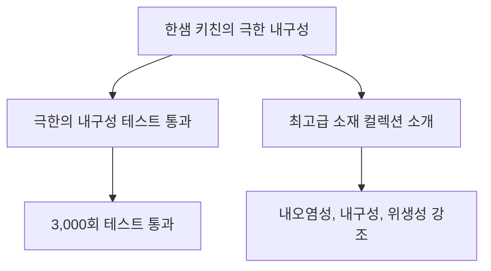

# [한샘 X＜흑백요리사＞시즌2] 강한 자만이 살아남는 한샘의 소재 컬렉션 (30s ver.)

> Source: https://www.youtube.com/watch?v=BAiOqG72c68
> Lilys: https://lilys.ai/digest/7917546/8771990
> ExportedAt: 2026-03-06T16:52:59+00:00
> Category: Etc/General

## Summary
- > 한샘의 소재 컬렉션은 <mark>3,000번의 테스트를 거쳐</mark> 어떤 빡센 재료나 환경에서도 살아남을 수 있는 뛰어난 내구성과 품질을 자랑합니다.
- 전문가조차 긴장하게 만든 **극한의 내구성 테스트** 비결을 엿볼 수 있습니다. 3,000번의 테스트를 통과한 **최고급 소재들의 생존력**을 확인하고, 우리 집 주방에 필요한 **실질적인 품질 기준**을 세워보세요. 이 자료는 주방 가구를 고를 때 흔들리지 않는 **확실한 품질 판단 기준**을 제공합니다.
- A["한샘 키친의 극한 내구성"] --> B["극한의 내구성 테스트 통과"]

---

##### 📌 한샘의 소재 컬렉션이 '강한 자만이 살아남는' 환경에서 생존할 수 있는 비결은 무엇인가?
> 한샘의 소재 컬렉션은 <mark>3,000번의 테스트를 거쳐</mark> 어떤 빡센 재료나 환경에서도 살아남을 수 있는 뛰어난 내구성과 품질을 자랑합니다.

---

전문가조차 긴장하게 만든 **극한의 내구성 테스트** 비결을 엿볼 수 있습니다. 3,000번의 테스트를 통과한 **최고급 소재들의 생존력**을 확인하고, 우리 집 주방에 필요한 **실질적인 품질 기준**을 세워보세요. 이 자료는 주방 가구를 고를 때 흔들리지 않는 **확실한 품질 판단 기준**을 제공합니다.

# 한샘 X＜흑백요리사＞시즌2] 강한 자만이 살아남는 한샘의 소재 컬렉션 (30s ver.)

## 1. 극한의 내구성 테스트를 통과한 한샘 키친
<mark>한샘 키친은 전문가조차 긴장하게 만든 극한의 내구성 테스트를 통과하며 그 생존력을 증명했다.</mark>
1. **극한의 테스트 환경**
   1. 셰프조차 재료가 빡세서 살아남을 수 있을지 걱정할 정도의 극한 테스트를 진행했다.
   2. 이 테스트의 목표는 **생존**이다.
2. **테스트 횟수**
   1. 테스트는 무려 **3,000번** 진행되었다.
   2. 이 결과에 대해 관계자는 존경을 표했다.

---
## 2. 한샘 키친의 품질을 증명하는 구체적인 테스트 내용
<mark>한샘 키친은 가정에서 흔히 발생하는 오염 및 사용 환경을 모사한 구체적인 테스트를 통해 품질을 입증했다.</mark>
1. **내오염성 테스트**
   1. 가정에서 자주 사용하는 **커피**나 **김치 국물** 등을 사용하여 24시간 동안 내오염 테스트를 진행한다.
2. **내구성 테스트 (도어 개폐)**
   1. **4만 회**의 도어 개폐 테스트를 진행하여, 하루에 10번씩 10년간 사용해도 문제가 없음을 확인한다.
3. **설치 강도 테스트**
   1. **227kg**의 하중을 가하는 벽장 설치 강도 테스트를 통과하여, 많은 물건을 보관해도 쉽게 떨어지지 않음을 보장한다.

---
## 3. 극한 환경에서 살아남은 최상급 소재 컬렉션
<mark>한샘 키친은 내오염성, 위생성, 심미성을 모두 갖춘 최상급 소재들을 사용하여 프리미엄 키친을 구성한다.</mark>
1. **내오염에 강한 이탈리아산 세라믹**
2. **이음새가 없어 위생적이고 깔끔한 스테인리스**
3. **자연스러운 무늬결을 느낄 수 있는 최고급 유럽산 무늬목**
4. **자동차 외장재와 동일한 우레탄 도료를 사용한 도장 도어**

---
## 4. 결론 및 메시지
<mark>키친 선택에 있어 실력이 중요하며, 한샘 키친은 테스트로 증명된 품질을 제공한다.</mark>
1. **핵심 메시지**
   1. 키친은 **실력**이다.
   2. 한샘 키친은 이러한 실력을 바탕으로 한다.

## Related
- [[노동의 의미가 바뀌고 있다 | 우리는 지금 어디로 가고 있나 | #지식채널e]]
- [[사장들 다 집합시켜 (트럼프)]]