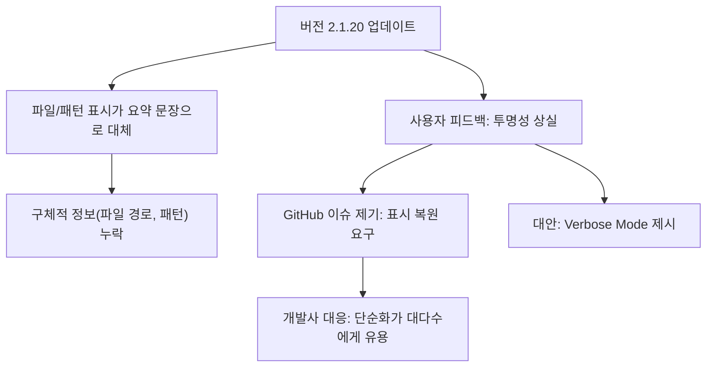

# Claude Code가 단순화되고 있나? | GeekNews

> Source: https://share.google/aEh3UbGEjHjiJbkrw
> Lilys: https://lilys.ai/digest/8136210/9071968
> ExportedAt: 2026-03-06T16:50:34+00:00
> Category: AI/Agents

## Summary
- AI 코딩 도구의 **투명성이 사라지는 순간**을 포착한 생생한 사례입니다. 최신 업데이트로 인해 **어떤 파일이 처리되는지 추적할 수 없게 된 문제**와 개발사의 대응 방식을 분석합니다. 복잡한 디버그 모드 대신, **사용자가 원하는 최소한의 정보 표시 기능**을 얻기 위해 어떻게 목소리를 내야 하는지 실질적인 교훈을 
- <mark>최신 버전에서 파일 처리 및 검색 패턴에 대한 구체적인 정보가 단일 요약 문장으로 대체되어 사용자가 코드베이스 동작을 추적하기 어려워짐.</mark>
- A["버전 2.1.20 업데이트"] --> B["파일/패턴 표시가 요약 문장으로 대체"]

---

AI 코딩 도구의 **투명성이 사라지는 순간**을 포착한 생생한 사례입니다. 최신 업데이트로 인해 **어떤 파일이 처리되는지 추적할 수 없게 된 문제**와 개발사의 대응 방식을 분석합니다. 복잡한 디버그 모드 대신, **사용자가 원하는 최소한의 정보 표시 기능**을 얻기 위해 어떻게 목소리를 내야 하는지 실질적인 교훈을 얻을 수 있습니다.

## 1. Claude Code의 투명성 문제: 단순화로 인한 핵심 정보 손실
<mark>최신 버전에서 파일 처리 및 검색 패턴에 대한 구체적인 정보가 단일 요약 문장으로 대체되어 사용자가 코드베이스 동작을 추적하기 어려워짐.</mark>

### 1.1. 버전 2.1.20의 주요 변경 사항
1. **파일 읽기 및 검색 패턴 출력이 요약 문장으로 대체됨**
   1. 이전에는 어떤 파일이 읽혔는지, 어떤 패턴이 검색되었는지 구체적으로 표시되었음.
   2. 새 버전에서는 "Read 3 files", "Searched for 1 pattern"과 같은 한 줄 요약으로 변경됨.

2. **투명성 상실에 대한 비판**
   1. 월 200달러를 지불하는 사용자들 사이에서 도구의 투명성이 사라졌다는 비판이 제기됨.

### 1.2. 사용자 반응 및 GitHub 이슈 제기
1. **사용자들의 핵심 요구 사항**
   1. GitHub 이슈를 통해 파일 경로와 검색 패턴 표시를 복원하거나 토글 옵션을 추가할 것을 요구함.
2. **Anthropic의 초기 대응**
   1. Anthropic은 단순화가 대다수 사용자에게 잡음을 줄이는 개선이라고 응답함.
   2. 그러나 실제로는 불만 댓글이 대부분이었음.
3. **제시된 대안: Verbose Mode**
   1. Anthropic이 제시한 해결책은 'verbose mode' 사용 권장이었음.

### 1.3. 'Verbose Mode'의 논란과 실용성 문제
1. **Verbose Mode의 과도한 출력 내용**
   1. thinking traces, hook output, sub-agent transcript, 전체 파일 내용까지 터미널에 출력함.
   2. 사용자들은 원하는 것은 단순히 파일 경로와 검색 패턴 표시뿐이라며 불만을 제기함.
2. **개발자와 사용자 간의 요구 불일치**
   1. 개발자는 verbose mode를 개선하겠다고 했으나, 사용자들은 변경 사항을 되돌리거나 토글 추가를 반복 요청함.
3. **요약 문장의 무의미함 지적**
   1. "Searched for 13 patterns, read 2 files"와 같은 문장은 사용자에게 아무 의미 없는 정보라는 지적이 있었음.

### 1.4. 이후 버전의 조정과 문제의 지속
1. **Verbose Mode의 부분적 조정**
   1. 이후 버전에서 thinking traces와 hook output 일부가 제거되어 덜 장황하게 조정됨.
   2. 하지만 여전히 sub-agent 전체 출력이 표시되어 화면이 복잡함.
2. **가독성 저하 문제**
   1. 이전에는 각 sub-agent 작업이 간결한 한 줄 스트림으로 표시되었음.
   2. 현재는 여러 에이전트의 대량 텍스트가 동시에 출력되어 가독성이 떨어짐.
3. **근본적 해결책에 대한 비판**
   1. verbose mode에서 요소를 하나씩 제거하는 것은 결국 토글 기능을 다시 만드는 것과 다를 바 없다는 비판이 제기됨.

### 1.5. 사용자 대응 및 결론
1. **사용자들의 임시 조치**
   1. 일부 사용자는 **버전 2.1.19로 되돌리는(pinning)** 조치를 취함.
2. **요청된 수정의 단순성**
   1. 요청된 수정은 단순한 불리언 설정 플래그 추가로 해결 가능함.
   2. 개발사는 verbose mode 조정에만 집중하는 태도를 보임.
3. **Anthropic 태도에 대한 풍자**
   1. 글은 Anthropic의 슈퍼볼 광고 메시지와 GitHub에서의 실제 대응 방식 간의 괴리를 지적하며 마무리됨.

## Related
- [[AI 에이전트 및 개발 도구: OpenClaw, Streamerbait, Claude Auto Memory]]
- [[진짜 어그로 아니고 AI가 대신 일해줌 ㄷㄷ 마누스AI 조연출 채용 후기 / 오목교 전자상가]]
