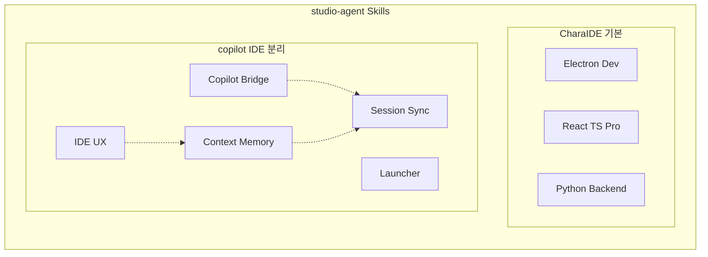

# studio-agent 에이전트 분리 현황

#agent #dev-tools #architecture #studio

## 개요
copilot IDE 핸드오프 문서 (808줄) 분석 후 기능 도메인별 전문 에이전트 스킬로 분리.

**스킬 총 8개**: 3 (기본) + 5 (copilot IDE 분리)

## 전체 스킬 목록

### 기본 스킬 (CharaIDE 용)
| 스킬 | 담당 |
|---|---|
| **Electron Development** | main/renderer/preload, IPC, 패키징 |
| **React TypeScript Pro** | 컴포넌트, hooks, 성능 |
| **Python Backend** | Edge-TTS, subprocess, REST API |

### copilot IDE 분리 스킬
| 스킬 | 담당 | 원본 핸드오프 섹션 |
|---|---|---|
| **Copilot Bridge Agent** | Hub/Worker lifecycle, health | §9 Hub/Bridge |
| **Context Memory Agent** | POLICY/MEMORY/ARTIFACTS | §G Context/Memory |
| **Session Sync Agent** | Codex/Copilot/AG 세션 동기화 | §3,4,6,7 Paths |
| **IDE UX Agent** | Composer/Sidebar/질문/내보내기 | §E,I UX/Debug |
| **Launcher Agent** | 슬롯/프로필/환경 감지/.desktop | §1 Launchers |

## 에이전트 분리 다이어그램

## 미해결 이슈 (핸드오프에서 인계)
- ⚠️ GUI 한글 입력 아직 unresolved (IDE UX Agent 담당)
- hub card가 worker-level health까지 미반영

## 관련
- [[studio-agent]] — 프로젝트 메인 노트
- [[CharaIDE]] — 주요 적용 프로젝트
