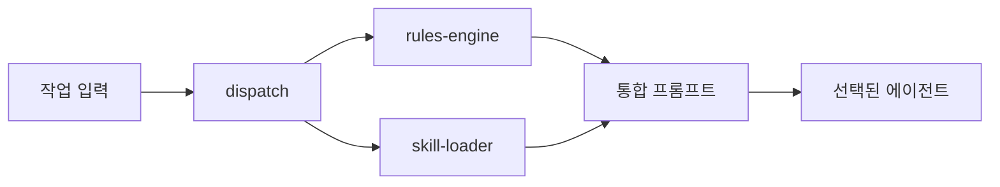

# [[Studio-agent|studio-agent]] — 통합 개발 에이전트

#agent #dev-tools #architecture #studio

## 개요
모든 AI 개발 도구의 장점을 취합한 통합 에이전트 [[오케스트레이터|오케스트레이터]].

**리포**: [Kyuha927/studio-agent](https://github.com/Kyuha927/studio-agent)
**경로**: `~/다운로드/Windows_Projects/studio-agent/`

## 아키텍처 — 장점 취합

| 모듈 | 원본 도구 | 가져온 핵심 장점 |
|---|---|---|
| **dispatch** | [[STUDIO.md]] | 작업 유형별 최적 모델 자동 선택 (affinity matrix) |
| **rules-engine** | [[Cursor Rules|Cursor Rules]] | `.cursor/rules/` 파서 → 프롬프트 자동 주입 |
| **skill-loader** | [[Claude Code Skills|Claude Code Skills]] | `.claude/skills/` 3단계 프로그레시브 로딩 |
| **git-agent** | [[Aider|Aider]] | Git 자동 커밋 + conventional commits (Sprint 2) |
| **checkpoint** | Cline | 스냅샷/롤백 + 세션 간 메모리 (Sprint 2) |
| **team-runner** | [[CrewAI|CrewAI]] | AGENTS.md 역할 기반 파이프라인 (Sprint 3) |
| **[[MCP|mcp]]-bridge** | MCP | 외부 도구 표준 연결 (Sprint 3) |
| **sandbox** | [[OpenHands|OpenHands]] | Docker 격리 실행 (Sprint 3) |

## CLI 사용법

```bash
# 전체 오케스트레이션
studio-agent run --project ~/chara-ide --task "TTS 버튼 추가" --dry-run --verbose

# 모델 라우팅
studio-agent dispatch --task "리팩토링" 
# → claude-code (10/10) 자동 선택

# 스킬/규칙 확인
studio-agent skills
studio-agent rules --project ~/chara-ide
```

## 파이프라인 흐름



## 리서치 기반

조사한 도구 전체 목록:
- **Claude Code Skills**: `.claude/skills/` 디렉토리, `npx skills add`, 3단계 로딩
- **오픈소스**: CrewAI, AutoGen, OpenHands, SWE-agent, Aider, LangGraph
- **AI IDE**: Cursor (agent mode), Windsurf, Cline, Continue.dev
- **MCP**: context7, GitHub MCP, coderunner, serena
- **기존 인프라**: STUDIO.md (Antigravity × Codex × Claude)

## 관련 프로젝트
- [[CharaIDE]] — 주요 적용 프로젝트
- [[STUDIO.md]] — 모델 비교우위 분업 체계