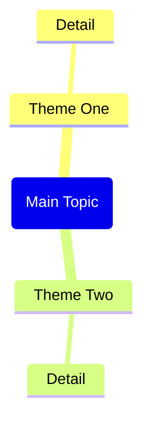

Based on the web page content provided in the context (from Obsidian Web Clipper or Web Viewer), generate a complete Obsidian note.

IMPORTANT: If no web page context is found, remind the user to:
1. Open a web page in Web Viewer (or use @ to select a web tab)
2. Or open a note clipped by Obsidian Web Clipper
3. Then use this command again

Generate the note with this exact structure:

---
title: "<page title>"
source: "<page url>"
description: "<brief description>"
tags:
  - "clippings"
---

## Summary

<Brief 2-3 paragraph summary of the page content>

## Key Takeaways

<List 5-8 key takeaways as bullet points>

## Mindmap

CRITICAL Mermaid mindmap syntax rules - MUST follow exactly:
- Root node format: root(Topic Name) - use round brackets, NO double brackets
- Child nodes: just plain text, no brackets needed
- Do NOT use quotes, parentheses, brackets, or any special characters in text
- Keep all node text short and simple - max 3-4 words per node

## Notable Quotes

<List 3-5 notable quotes from the content, if any>

Return only the markdown content without any explanations or comments.

## 웹페이지 클리핑 노트 생성 가이드 보강 (2026-02-15)
### 문서별 관찰
- 제목/소스/설명의 기본값을 명확히 정해 두면 클리핑 품질이 좋아집니다.
- URL을 표준 형태로 정리하고(UTM/fbclid 제거) 저장하면 중복 노트 생성을 줄여 줍니다.
- Mermaid 문법이 깨지지 않게 하려면 노드 이름을 단순하게 정리해야 합니다.
### 권장 작업
1. `source_normalized` 필드를 추가해 두세요.
2. 상단에 컨텍스트 없는 대체를 배치하세요.
3. 긴 인용문보다 짧은 인용문 + 요약을 선호하세요.
### 참고 링크
- https://help.obsidian.md/web-clipper
- https://github.com/obsidianmd/obsidian-clipper

<!-- CHATGPT_EXPORT_MERGE:1348789d4699 -->
## ChatGPT Export 통합 (2026-03-03)
- 원본: [[workspace-links/_tools/chatgpt-export/topics/Antigravity-CodeTracker/2026-03-03_Dialog_안정화_Phase_2_69a11f98-385c-83a2-96f0-b1b7055bcfa2|Dialog 안정화 Phase 2]]
- 토픽: `Antigravity-CodeTracker`
- conversation_id: `69a11f98-385c-83a2-96f0-b1b7055bcfa2`
- 유사도: `0.156`

### 요약
아래 HANDOFF 기준으로 love-ai-template 작업 이어서 진행해. 우선순위: Dialog 안정화 Phase 2 (스펙 준수 + QA 10케이스 통과). Non-negotiables: - Input reads only through src/core/input.lua - Mode switch only by State.game.mode (combat/dialog/pause) - Dialog data remains in data/dialog/*.lua (no hardcoding) - Typewriter uses reveal state only; source text must remain unchanged - UI contro...

### 세부 메모
(no transcript)

<!-- /CHATGPT_EXPORT_MERGE:1348789d4699 -->

<!-- CHATGPT_EXPORT_MERGE:3bd860ee5498 -->
## ChatGPT Export 통합 (2026-03-03)
- 원본: [[workspace-links/_tools/chatgpt-export/topics/Copilot-Prompts/2026-03-03_Pixel_Art_UI_Design_69984d4c-ede0-83a4-973c-f9ec5395b39b|Pixel Art UI Design]]
- 토픽: `Copilot-Prompts`
- conversation_id: `69984d4c-ede0-83a4-973c-f9ec5395b39b`
- 유사도: `0.281`

### 요약
16-bit pixel art game UI screenshot, cozy fantasy tavern background with a crowd of chibi pixel characters softly blurred (depth of field). Centered ornate decorative pixel frame with gold filigree corners. Title text: “DAILY FANDOM QUESTS” in chunky pixel font with subtle outline. Inside the panel: four horizontal quest rows with icon on the left (play b...

### 세부 메모
# Pixel Art UI Design
- topic: `Copilot-Prompts`
- source: `0de9e284f70b860fe63b5e28aaddc0ee7a22bd1dab6fc430bd0bf284a7a94070-2026-02-28-12-01-06-6b187fa97d244cc5beb7efa352c5af1f.zip::conversations-000.json`
- source_txt: `/mnt/c/Users/jhk92/OneDrive/문서/GitHub/ai/Moltbot/tools/handoff/bridge_outbox_tabs/69984d4c-ede0-83a4-973c-f9ec5395b39b_Pixel_Art_UI_Design.txt`
- conversation_id: `69984d4c-ede0-83a4-973c-f9ec5395b39b`
- matched_keywords: prompt
- card: [[workspace-links/_catalog/cards/Copilot-Prompts|코파일럿 프롬프트 라이브러리]]
## Summary
## Transcript
## 1. user
## 2. assistant
## 3. tool
16-bit pixel art game UI screenshot, cozy fantasy tavern background with a crowd of chibi pixel characters softly blurred (depth of field). Centered ornate decorative pixel frame with gold filigree corners. Title text: “DAILY FANDOM QUESTS” in chunky pixel font with subtle outline. Inside the panel: four horizontal quest rows with icon on the left (play b...
16-bit pixel art game UI screenshot, cozy fantasy tavern background with a crowd of chibi pixel characters softly blurred (depth of field). Centered ornate decorative pixel frame with gold filigree corners. Title text: “DAILY FANDOM QUESTS” in chunky pixel font with subtle outline. Inside the panel: four horizontal quest rows with icon on the left (play button, heart, chat bubble, share arrow), each row has a progress bar with pastel fill and a small “CLAIM” button on the right. Top HUD bar shows “Token Balance: 12,500 FANGOLD” on the left and “Current Event: ‘STARLIGHT SERENADE’ LIVE!” on the right, with a small clock/time in the middle. Warm pastel palette (lavender, peach, cream), soft glow particles/bokeh, crisp pixel edges, clean readable typography, centered composition, UI-first, no real-world text except the specified labels, no logos, no watermark, high clarity, 1024x1024.
{"prompt":null,"size":"1024x1024","n":1}
{'asset_pointer': 'sediment://file_00000000bb1c7208a7ae6e9017130a2d', 'content_type': 'image_asset_pointer', 'fovea': None, 'height': 1024, 'metadata': {'asset_pointer_link': None, 'container_pixel_height': 1024, 'container_pixel_width': 1024, 'dalle': {'edit_op': None, 'gen_id': '375ccf38-5bfa-4f28-bfa9-937b0...

<!-- /CHATGPT_EXPORT_MERGE:3bd860ee5498 -->

<!-- CHATGPT_EXPORT_MERGE:acc39c513b08 -->
## ChatGPT Export 통합 (2026-03-03)
- 원본: [[workspace-links/_tools/chatgpt-export/topics/Antigravity-CodeTracker/2026-03-03_픽셀_아트_UI_프롬프트_69984d1e-68b8-83a9-84a5-b33dc82846a6|픽셀 아트 UI 프롬프트]]
- 토픽: `Antigravity-CodeTracker`
- conversation_id: `69984d1e-68b8-83a9-84a5-b33dc82846a6`
- 유사도: `0.158`

### 요약
{'asset_pointer': 'sediment://file_00000000af307208a5c935103ed6220b', 'content_type': 'image_asset_pointer', 'fovea': None, 'height': 2048, 'metadata': {'asset_pointer_link': None, 'container_pixel_height': None, 'container_pixel_width': None, 'dalle': None, 'emu_omit_glimpse_image': None, 'emu_patches_override': None, 'generation': None, 'gizmo': None, '...

### 세부 메모
# 픽셀 아트 UI 프롬프트
- topic: `Antigravity-CodeTracker`
- source: `0de9e284f70b860fe63b5e28aaddc0ee7a22bd1dab6fc430bd0bf284a7a94070-2026-02-28-12-01-06-6b187fa97d244cc5beb7efa352c5af1f.zip::conversations-000.json`
- source_txt: `/mnt/c/Users/jhk92/OneDrive/문서/GitHub/ai/Moltbot/tools/handoff/bridge_outbox_tabs/69984d1e-68b8-83a9-84a5-b33dc82846a6_UI.txt`
- conversation_id: `69984d1e-68b8-83a9-84a5-b33dc82846a6`
- matched_keywords: log
- card: [[workspace-links/_catalog/cards/Antigravity-CodeTracker|실행 로그·코드 추적 허브]]
## Summary
## Transcript
## 1. user
## 2. assistant
### 프롬프트 1 (가장 비슷한 “픽셀 아트 + 장식 프레임 + 퀘스트 패널”)
### 프롬프트 2 (더 “게임 스크린샷” 느낌, 인터랙션 요소 강화)
### 프롬프트 3 (더 “레트로 RPG UI” 쪽, 프레임 디테일 과장)
### 프롬프트 4 (가로 배너/PC UI 느낌 16:9)
### 공통으로 뒤에 붙일 “피해야 할 것(문장)” (옵션)
{'asset_pointer': 'sediment://file_00000000af307208a5c935103ed6220b', 'content_type': 'image_asset_pointer', 'fovea': None, 'height': 2048, 'metadata': {'asset_pointer_link': None, 'container_pixel_height': None, 'container_pixel_width': None, 'dalle': None, 'emu_omit_glimpse_image': None, 'emu_patches_override': None, 'generation': None, 'gizmo': None, '...
{'asset_pointer': 'sediment://file_00000000af307208a5c935103ed6220b', 'content_type': 'image_asset_pointer', 'fovea': None, 'height': 2048, 'metadata': {'asset_pointer_link': None, 'container_pixel_height': None, 'container_pixel_width': None, 'dalle': None, 'emu_omit_glimpse_image': None, 'emu_patches_override': None, 'generation': None, 'gizmo': None, 'is_no_auth_placeholder': None, 'lpe_delta_encoding_channel': None, 'lpe_keep_patch_ijhw': None, 'sanitized': True, 'watermarked_asset_pointer': None}, 'size_bytes': 1724109, 'width': 2048}
이런 느낌의 ui를 달리로 뽑으려면 무슨 프롬프트
> 16-bit pixel art game UI screenshot, cozy fantasy tavern background with a crowd of chibi pixel characters softly blurred (depth of field). Centered ornate decorative pixel frame with gold filigree corners. Title text: “DAILY FANDOM QUESTS” in chunky pixel font with subtle outline. Inside the panel: four horizontal quest rows with icon on the left (play button, heart, chat bubble, share arrow), each row has a progress bar with pastel fill and a small “CLAIM” button on the right. Top HUD bar sh...

<!-- /CHATGPT_EXPORT_MERGE:acc39c513b08 -->

<!-- CHATGPT_EXPORT_MERGE:cce04fb8763e -->
## ChatGPT Export 통합 (2026-03-03)
- 원본: [[workspace-links/_tools/chatgpt-export/topics/Copilot-Prompts/2026-03-03_Pixel_Art_UI_Design_69984d67-5c10-83a2-a191-bdc6c4c51c68|Pixel Art UI Design]]
- 토픽: `Copilot-Prompts`
- conversation_id: `69984d67-5c10-83a2-a191-bdc6c4c51c68`
- 유사도: `0.140`

### 요약
Pixel art mobile game interface, ornate gold pixel border around the entire screen, soft vignette. Background: stage area with two large poster screens and chibi audience, heavily blurred to emphasize UI. Foreground: large centered quest window with beveled pixel panels, subtle glassy highlight, drop shadow. Four quest items with progress numbers (e.g., 5...

### 세부 메모
# Pixel Art UI Design
- topic: `Copilot-Prompts`
- source: `0de9e284f70b860fe63b5e28aaddc0ee7a22bd1dab6fc430bd0bf284a7a94070-2026-02-28-12-01-06-6b187fa97d244cc5beb7efa352c5af1f.zip::conversations-000.json`
- source_txt: `/mnt/c/Users/jhk92/OneDrive/문서/GitHub/ai/Moltbot/tools/handoff/bridge_outbox_tabs/69984d67-5c10-83a2-a191-bdc6c4c51c68_Pixel_Art_UI_Design.txt`
- conversation_id: `69984d67-5c10-83a2-a191-bdc6c4c51c68`
- matched_keywords: prompt
- card: [[workspace-links/_catalog/cards/Copilot-Prompts|코파일럿 프롬프트 라이브러리]]
## Summary
## Transcript
## 1. user
## 2. assistant
## 3. tool
## 4. user
## 5. assistant
## 6. tool
## 7. user
## 8. assistant
## 9. tool
## 10. user
## 11. assistant
## 12. tool
## 13. user
## 14. assistant
## 15. tool
## 16. user
## 17. assistant
## 18. tool
## 19. user
## 20. assistant
## 21. tool
Pixel art mobile game interface, ornate gold pixel border around the entire screen, soft vignette. Background: stage area with two large poster screens and chibi audience, heavily blurred to emphasize UI. Foreground: large centered quest window with beveled pixel panels, subtle glassy highlight, drop shadow. Four quest items with progress numbers (e.g., 5...
Pixel art mobile game interface, ornate gold pixel border around the entire screen, soft vignette. Background: stage area with two large poster screens and chibi audience, heavily blurred to emphasize UI. Foreground: large centered quest window with beveled pixel panels, subtle glassy highlight, drop shadow. Four quest items with progress numbers (e.g., 5/5, 3/5, 1/3, 0/1), progress bars, and right-aligned “CLAIM” buttons in different pastel colors. Bottom center button: “VIEW ALL CHALLENGES” in a pill-shaped pixel button. Bottom chat input bar with placeholder “Type Message Here…”. Cute confetti particles floating. Consistent 16-bit palette, anti-aliased look avoided, sharp pixel clusters, readable spacing, clean UI hierarchy, 1024x1024.
{"prompt":null,"size":"1024x1024","n":1}
{'asset_pointer': 'sediment://file_000000001e807208881a182ac36a801a', 'content_type': 'image_asset_pointer', 'fovea': None, 'height': 1024, 'metadata': {'asset_pointer_link': None, 'container_pixel_height': 1024, 'con...

<!-- /CHATGPT_EXPORT_MERGE:cce04fb8763e -->
