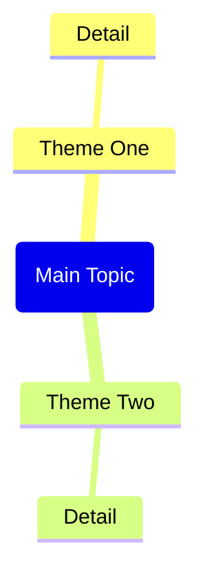

# File
copilot/copilot-custom-prompts/Clip Web Page.md

# Prompt
Role: Technical documentation enhancement editor.
Goal: Improve the markdown document using current, evidence-backed research.
Rules:
- Add source URLs for factual claims.
- Use absolute dates (YYYY-MM-DD) for recent facts.
- Remove duplication and improve structure.
Output:
1) Top 10 improvement points
2) Research summary with sources
3) Final integrated markdown ready to paste

Document source:
```markdown
---
copilot-command-context-menu-enabled: false
copilot-command-slash-enabled: true
copilot-command-context-menu-order: 1140
copilot-command-model-key: ""
copilot-command-last-used: 0
---

Based on the web page content provided in the context (from Obsidian Web Clipper or Web Viewer), generate a complete Obsidian note.

IMPORTANT: If no web page context is found, remind the user to:
1. Open a web page in Web Viewer (or use @ to select a web tab)
2. Or open a note clipped by Obsidian Web Clipper
3. Then use this command again

Generate the note with this exact structure:

---
title: "<page title>"
source: "<page url>"
description: "<brief description>"
tags:
  - "clippings"
---

## Summary

<Brief 2-3 paragraph summary of the page content>

## Key Takeaways

<List 5-8 key takeaways as bullet points>

## Mindmap

CRITICAL Mermaid mindmap syntax rules - MUST follow exactly:
- Root node format: root(Topic Name) - use round brackets, NO double brackets
- Child nodes: just plain text, no brackets needed
- Do NOT use quotes, parentheses, brackets, or any special characters in text
- Keep all node text short and simple - max 3-4 words per node



## Notable Quotes

<List 3-5 notable quotes from the content, if any>

Return only the markdown content without any explanations or comments.

## 웹페이지 클리핑 노트 생성 가이드 보강 (2026-02-15)
### 문서별 관찰
- 제목/소스/설명의 기본값을 명확히 정해 두면 클리핑 품질이 좋아집니다.
- URL을 표준 형태로 정리하고(UTM/fbclid 제거) 저장하면 중복 노트 생성을 줄여 줍니다.
- Mermaid 문법이 깨지지 않게 하려면 노드 이름을 단순하게 정리해야 합니다.
### 권장 작업
1. `source_normalized` 필드를 추가해 두세요.
2. 상단에 컨텍스트 없는 대체를 배치하세요.
3. 긴 인용문보다 짧은 인용문 + 요약을 선호하세요.
### 참고 링크
- https://help.obsidian.md/web-clipper
- https://github.com/obsidianmd/obsidian-clipper

```
