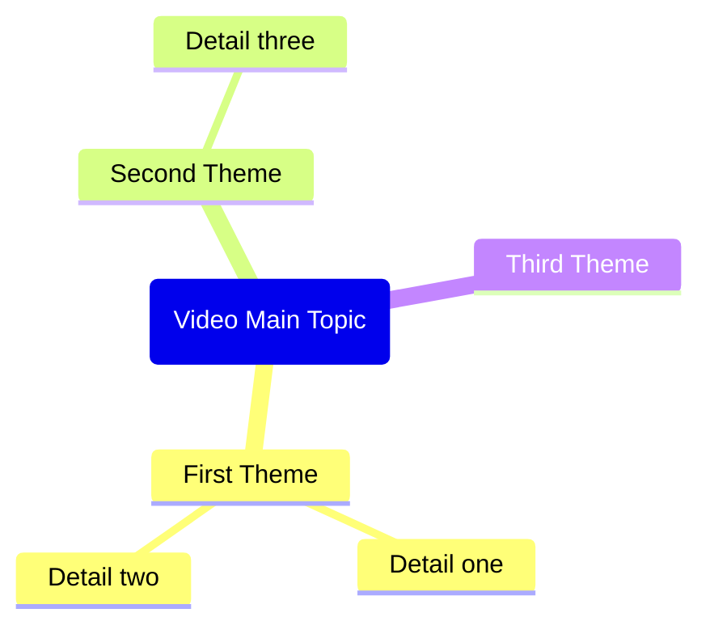

# File
copilot/copilot-custom-prompts/Clip YouTube Transcript.md

# Prompt
Role: Technical documentation enhancement editor.
Goal: Improve the markdown document using current, evidence-backed research.
Rules:
- Add source URLs for factual claims.
- Use absolute dates (YYYY-MM-DD) for recent facts.
- Remove duplication and improve structure.
Output:
1) Top 10 improvement points
2) Research summary with sources
3) Final integrated markdown ready to paste

Document source:
```markdown
---
copilot-command-context-menu-enabled: false
copilot-command-slash-enabled: true
copilot-command-context-menu-order: 1130
copilot-command-model-key: ""
copilot-command-last-used: 0
---

Based on the YouTube video information and transcript provided in the context, generate a complete Obsidian note in the following format.

IMPORTANT: If no YouTube video context is found, remind the user to:
1. Open a YouTube video in Web Viewer (or use @ to select a YouTube web tab)
2. Then use this command again

Generate the note with this exact structure:

---
title: "<video title>"
description: "<first 200 chars of description>"
channel: "<channel name>"
url: "<video url>"
duration: "<duration>"
published: <upload date in YYYY-MM-DD format>
thumbnailUrl: "<YouTube thumbnail URL: i.ytimg.com/vi/VIDEO_ID/maxresdefault.jpg with https protocol>"
genre:
  - "<genre>"
watched:
---


> [!summary]- Description
> <full video description, preserve line breaks>

## Summary

<Brief 2-3 paragraph summary of the video content>

## Key Takeaways

<List 5-8 key takeaways as bullet points>

## Mindmap

CRITICAL Mermaid mindmap syntax rules - MUST follow exactly:
- Root node format: root(Topic Name) - use round brackets, NO double brackets
- Child nodes: just plain text, no brackets needed
- Do NOT use quotes, parentheses, brackets, or any special characters in text
- Do NOT use icons or emojis
- Keep all node text short and simple - max 3-4 words per node
- Use only letters, numbers, and spaces

Example of CORRECT syntax:


## Notable Quotes

<List 5-10 notable quotes from the transcript. Format each as:>
- [<timestamp>: <quote text>](<video_url>&t=<seconds>s)

Return only the markdown content without any explanations or comments.

## 유튜브 전사 클리핑 워크플로 보강 (2026-02-15)
### 문서별 관찰
- 게시 날짜는 `snippet.publishedAt`, 길이는 `contentDetails.duration`을 기준으로 잡는 편이 안전합니다.
- `maxresdefault` 썸네일은 보장되지 않습니다. 대체 논리가 필요합니다.
- 타임스탬프 링크는 `&t=<seconds>s` 형식으로 유지되어야 합니다.
### 권장 작업
1. 원시 기간과 사람이 읽기 쉬운 기간을 모두 저장하세요.
2. 포맷이 실패할 경우 원시 타임스탬프를 보존하세요.
3. 눈에 띄는 인용문에는 모두 타임스탬프를 붙이세요.
### 참고 링크
- https://developers.google.com/youtube/v3/docs/videos

```
