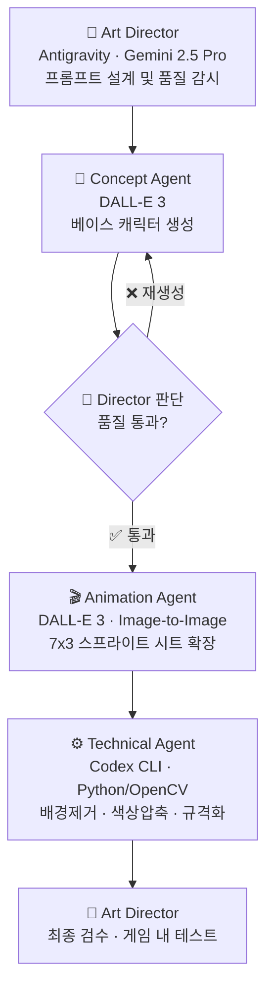

# 🖌️ Pixel Agents: 아트 생성 에이전트 팀

최상의 16-bit 픽셀 아트 퀄리티와 일관성을 유지하기 위해 구성된 **AI 에이전트 전담 디자인 팀**의 구조와 워크플로우입니다.

---

## 👥 에이전트 팀 구성 (The Design Squad)

### 1. 👑 Art Director (리드 디자이너)
- **담당 모델**: Antigravity (Gemini 2.5 Pro)
- **역할**: 시각적 품질 통제 및 아트 디렉션 기준 수립
- **책임**:
  - `ART_DIRECTION.md`의 규칙(1px 외곽선, 4색 팔레트, 16x32 제약)이 지켜지고 있는지 감시
  - 생성된 에셋의 실루엣 검수 및 직업별 개성(클래스 실루엣) 타당성 심사
  - 프롬프트 설계 및 반복 개선(Iteration) 지시

### 2. 🎨 Concept Generator (베이스 아트)
- **담당 모델**: DALL-E 3 (via Antigravity `generate_image`)
- **역할**: 캐릭터의 초기 디자인(Base Sprite) 도출
- **프롬프트 전략**:
  - 필수 키워드: `Nanobanana style`, `16-bit pixel art`, `JIK-A-4 Metro City aesthetic`, `~60 degree top-down`
  - 제약 키워드: `1px black outline`, `flat colors`, `no anti-aliasing`, `solid white background`
- **목표**: 매력적이고 깔끔한 단일 "스탠딩 포즈" 원본 레퍼런스 이미지 확보

### 3. 🎬 Animation Agent (스프라이트 시트 확장)
- **담당 모델**: DALL-E 3 (Image-to-Image, `ImagePaths` 레퍼런스 주입)
- **역할**: 원본 디자인을 유지한 채 7x3 동작 프레임으로 확장
- **파이프라인** (`.agents/workflows/consistent_sprite_sheet.md` 기반):
  1. Concept Agent가 만든 베이스 이미지를 `ImagePaths`로 주입
  2. "Maintain strict character consistency" 프롬프트로 외형 일관성 강제
  3. 7열 3행 그리드 스프라이트 시트 포맷으로 출력

### 4. ⚙️ Technical Refinement Agent (기술 정제)
- **담당 모델**: Codex CLI (GPT-5.4) + Python/OpenCV
- **역할**: AI 생성 이미지를 게임 엔진 레이아웃(최종 에셋)으로 구체화 및 최적화
- **실행 방식**: `scripts/prepare_rpg_sprite.py` 및 추가 Python 스크립트 가동
- **책임**:
  - 안티 앨리어싱(Anti-aliasing) 제거 및 하드 엣지(Hard-edge) 복원
  - 체크무늬/회색조 배경 제거 및 투명 픽셀(Alpha=0)화
  - 정확히 112x96 해상도로 슬라이싱/리사이즈 후 하단 중앙(Bottom-center) 앵커 정렬
  - 색상 수 정량화(Quantize) — 팔레트 4색 이내 억제

---

## 🚀 에이전트 간 협업 워크플로우

---

## 🎯 현재 실행 상태

| 직업군 | Concept ✅ | Animation | Technical | 최종 검수 |
|---|---|---|---|---|
| 기사 (Knight) | ✅ 베이스 생성 완료 | 🔄 진행 중 | ⏳ 대기 | ⏳ |
| 마법사 (Mage) | ⏳ | ⏳ | ⏳ | ⏳ |
| 궁수 (Ranger) | ⏳ | ⏳ | ⏳ | ⏳ |
| 사제 (Cleric) | ⏳ | ⏳ | ⏳ | ⏳ |
| 도적 (Rogue) | ⏳ | ⏳ | ⏳ | ⏳ |
| 기공사 (Artificer) | ⏳ | ⏳ | ⏳ | ⏳ |
