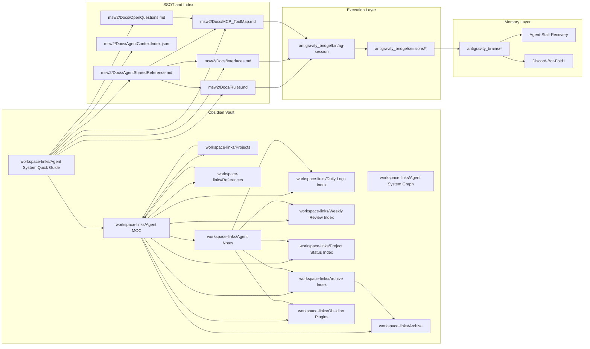

# Agent System Graph

이 노트는 에이전트 시스템의 관계를 한 번에 보는 지도다.

## 해석

- `Docs/`는 행동 기준이다.
- `antigravity_bridge`는 단발 실행을 고정한다.
- `antigravity_brains`는 누적된 기억과 복구력을 만든다.
- `workspace-links`는 이 모든 것을 Obsidian에서 빠르게 재진입하기 위한 진입점이다.
- 템플릿은 반복 작업의 형식을 고정한다.
- 주간 회고와 프로젝트 상태는 현재를 유지하는 운영 노트다.

## 실전 메모

- 새 작업을 시작하면 Quick Guide부터 연다.
- 길게 남길 내용은 Graph 노트에 따라 어디에 저장할지 결정한다.
- 일회성 결과는 브리지 세션에, 장기 판단은 브레인에 남긴다.
- 오늘 기록은 `Daily Logs/2026/2026-03-20.md`에 남겼다.