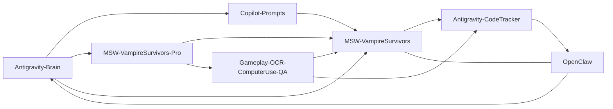

# 프로젝트 연관성 대시보드

- 실행 상태 보드: [[workspace-links/_catalog/04_execution_overview]]

## 연관성 네트워크


## 동일 분류 관계
```dataviewjs
const cards = dv.pages('"workspace-links/_catalog/cards"').where(p => p.type === "project-card");
const byPath = new Map(cards.map(p => [p.file.path, p]));
const rows = [];
const resolveTarget = (target) => {
  if (!target) return null;
  if (target.path && byPath.has(target.path)) return byPath.get(target.path);

  const raw = typeof target === "string" ? target : String(target);
  const m = raw.match(/\[\[([^|\]]+)(?:\|[^\]]+)?\]\]/);
  if (!m) return null;

  const candidate = m[1];
  if (byPath.has(candidate)) return byPath.get(candidate);
  if (byPath.has(`${candidate}.md`)) return byPath.get(`${candidate}.md`);

  for (const [path, page] of byPath.entries()) {
    if (path.endsWith(candidate) || path.endsWith(`${candidate}.md`)) return page;
  }
  return null;
};

for (const p of cards) {
  for (const rel of (p.relations ?? [])) {
    const target = resolveTarget(rel.target);
    if (!target) continue;
    if (target.domain === p.domain) {
      rows.push([p.file.link, p.domain, rel.kind ?? "", target.file.link, rel.strength ?? "", rel.direction ?? ""]);
    }
  }
}

dv.table(["From", "Domain", "Kind", "To", "Strength", "Direction"], rows);
```

## 분류 간 관계
```dataviewjs
const cards = dv.pages('"workspace-links/_catalog/cards"').where(p => p.type === "project-card");
const byPath = new Map(cards.map(p => [p.file.path, p]));
const rows = [];
const resolveTarget = (target) => {
  if (!target) return null;
  if (target.path && byPath.has(target.path)) return byPath.get(target.path);

  const raw = typeof target === "string" ? target : String(target);
  const m = raw.match(/\[\[([^|\]]+)(?:\|[^\]]+)?\]\]/);
  if (!m) return null;

  const candidate = m[1];
  if (byPath.has(candidate)) return byPath.get(candidate);
  if (byPath.has(`${candidate}.md`)) return byPath.get(`${candidate}.md`);

  for (const [path, page] of byPath.entries()) {
    if (path.endsWith(candidate) || path.endsWith(`${candidate}.md`)) return page;
  }
  return null;
};

for (const p of cards) {
  for (const rel of (p.relations ?? [])) {
    const target = resolveTarget(rel.target);
    if (!target) continue;
    if (target.domain !== p.domain) {
      rows.push([p.file.link, p.domain, rel.kind ?? "", target.file.link, target.domain, rel.strength ?? "", rel.direction ?? ""]);
    }
  }
}

dv.table(["From", "FromDomain", "Kind", "To", "ToDomain", "Strength", "Direction"], rows);
```

## 관계 + 상태 체크
```dataview
TABLE
  file.link AS Project,
  domain AS Domain,
  length(relations) AS RelationCount,
  status_now AS CurrentStatus,
  major_issues AS TopIssues
FROM "workspace-links/_catalog/cards"
WHERE type = "project-card"
SORT sequence_order ASC
```

<!-- CHATGPT_EXPORT_MERGE:657bb08bc5a1 -->
## ChatGPT Export 통합 (2026-03-03)
- 원본: [[workspace-links/_tools/chatgpt-export/topics/MSW-VampireSurvivors-Pro/2026-03-03_구형_그램_SSD_교체_69a2bcfa-9274-83a4-aa29-dbca80f55f05|구형 그램 SSD 교체]]
- 토픽: `MSW-VampireSurvivors-Pro`
- conversation_id: `69a2bcfa-9274-83a4-aa29-dbca80f55f05`
- 유사도: `0.128`

### 요약
구형 그램 ssd 가는 법

### 세부 메모
(no transcript)

<!-- /CHATGPT_EXPORT_MERGE:657bb08bc5a1 -->
