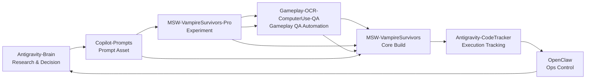
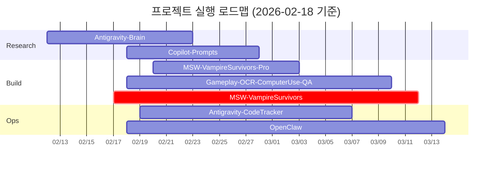

# 실행 현황 한눈 보드

- 칸반 보드: [[workspace-links/_catalog/05_kanban_execution]]

## 프로젝트 순서도


## 로드맵 간트차트


## 전체 현황
```dataview
TABLE
  sequence_order AS Seq,
  choice(display_name, display_name, file.link) AS Project,
  workflow_stage AS Stage,
  plan_start AS Start,
  plan_end AS End,
  progress_pct AS Progress,
  domain AS Domain,
  phase AS Phase,
  priority AS Priority,
  risk_level AS Risk,
  status_now AS CurrentStatus
FROM "workspace-links/_catalog/cards"
WHERE type = "project-card"
SORT sequence_order ASC
```

## 진행률 한눈 보기
```dataviewjs
const cards = dv.pages('"workspace-links/_catalog/cards"')
  .where(p => p.type === "project-card")
  .sort(p => p.sequence_order, 'asc');

const bar = (p) => {
  const pct = Number(p.progress_pct ?? 0);
  const clamped = Math.max(0, Math.min(100, pct));
  const filled = Math.round(clamped / 10);
  return "█".repeat(filled) + "░".repeat(10 - filled) + ` ${clamped}%`;
};

const rows = cards.map(p => [
  p.sequence_order,
  p.display_name ?? p.file.link,
  p.plan_start ?? "",
  p.plan_end ?? "",
  bar(p),
  p.risk_level ?? ""
]);

dv.table(["Seq", "Project", "Start", "End", "ProgressBar", "Risk"], rows);
```

## 문제 / 다음 할 일
```dataview
TABLE
  choice(display_name, display_name, file.link) AS Project,
  major_issues AS TopIssues,
  next_actions AS NextActions,
  last_review AS LastReview
FROM "workspace-links/_catalog/cards"
WHERE type = "project-card"
SORT sequence_order ASC
```

## 즉시 체크 (오늘)
```dataviewjs
const cards = dv.pages('"workspace-links/_catalog/cards"')
  .where(p => p.type === "project-card")
  .sort(p => p.sequence_order, 'asc');

const rows = cards.map(p => {
  const issue = (p.major_issues ?? [])[0] ?? "";
  const next = (p.next_actions ?? [])[0] ?? "";
  return [p.sequence_order, (p.display_name ?? p.file.link), issue, next, p.risk_level ?? ""];
});

dv.table(["Seq", "Project", "Today Issue", "Today Next", "Risk"], rows);
```
