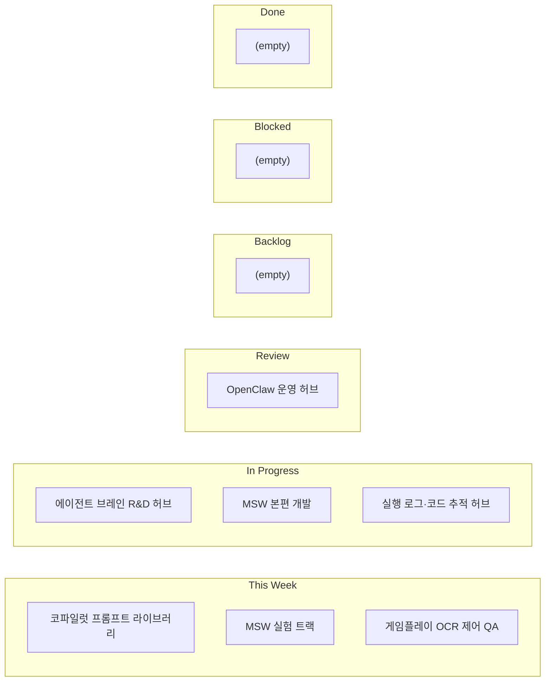

# 실행 칸반 보드

DataviewJS 없이도 바로 보이도록, 렌더 고정형 칸반으로 구성했습니다.

## 칸반 보드

## 레인별 상세

### Backlog
- 없음

### This Week
- [[workspace-links/_catalog/cards/Copilot-Prompts|코파일럿 프롬프트 라이브러리]]
  - 현재: 프롬프트 세트 확장 중, 버전별 성능 기록 보강 필요
  - 다음: 실패/성공 예시 페어 기록
- [[workspace-links/_catalog/cards/MSW-VampireSurvivors-Pro|MSW 실험 트랙]]
  - 현재: 실험 트랙 구조 확보, 본편 반영 기준 정리 필요
  - 다음: 성공/실패 기준표 작성
- [[workspace-links/_catalog/cards/Gameplay-OCR-ComputerUse-QA|게임플레이 OCR 제어 QA]]
  - 현재: OCR+입력 제어 기반 QA 툴 기획 완료, MVP 착수
  - 다음: 메인->인게임->결과 시나리오 1개 자동 실행 구현

### In Progress
- [[workspace-links/_catalog/cards/Antigravity-Brain|에이전트 브레인 R&D 허브]]
  - 현재: 문서 보강 진행 중, 실행 의사결정 정리 필요
  - 다음: 핵심 주제 의사결정 템플릿 적용
- [[workspace-links/_catalog/cards/MSW-VampireSurvivors|MSW 본편 개발]]
  - 현재: 핵심 로직 동작, 안정화 최우선
  - 다음: 회귀 체크리스트 고정
- [[workspace-links/_catalog/cards/Antigravity-CodeTracker|실행 로그·코드 추적 허브]]
  - 현재: 추적 동작 중, 로그 스키마 정합성 개선 필요
  - 다음: 공통 로그 스키마 v1 고정

### Blocked
- 없음

### Review
- [[workspace-links/_catalog/cards/OpenClaw|OpenClaw 운영 허브]]
  - 현재: 운영 허브 구축 완료, 자동화 규칙 강화 필요
  - 다음: 브리프/로그/리서치 링크 무결성 점검

### Done
- 없음

## 운영 규칙
1. 카드의 `kanban_lane`이 바뀌면 이 보드도 같이 업데이트합니다.
2. `Blocked` 이동 시 blocker를 카드 `major_issues` 첫 항목에 명시합니다.
3. 완료 항목은 `Done`으로 이동 후 `phase`를 `maintenance` 또는 `archived`로 조정합니다.

<!-- CHATGPT_EXPORT_MERGE:4211af19db45 -->
## ChatGPT Export 통합 (2026-03-03)
- 원본: [[workspace-links/_tools/chatgpt-export/topics/Antigravity-CodeTracker/2026-03-03_OCR_실패_스냅샷과_세_가지_진단_규칙_6995e875-55b4-83a2-8c3d-cf971483e260|OCR 실패 스냅샷과 세 가지 진단 규칙]]
- 토픽: `Antigravity-CodeTracker`
- conversation_id: `6995e875-55b4-83a2-8c3d-cf971483e260`
- 유사도: `0.276`

### 요약
(summary missing)

### 세부 메모
(no transcript)

<!-- /CHATGPT_EXPORT_MERGE:4211af19db45 -->
