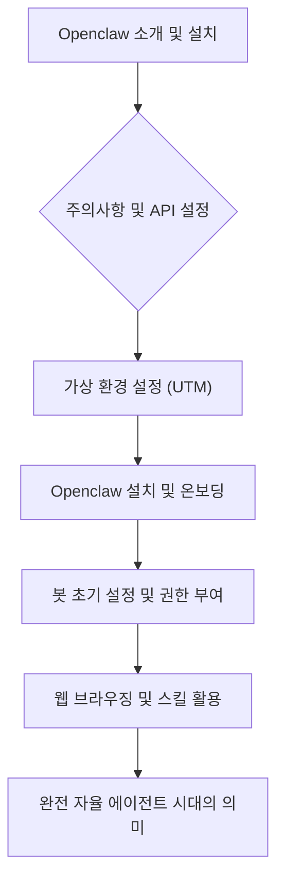

# OpenClaw 성공 비결

- topic: `Antigravity-CodeTracker`
- source: `0de9e284f70b860fe63b5e28aaddc0ee7a22bd1dab6fc430bd0bf284a7a94070-2026-02-28-12-01-06-6b187fa97d244cc5beb7efa352c5af1f.zip::conversations-000.json`
- source_txt: `/mnt/c/Users/jhk92/OneDrive/문서/GitHub/ai/Moltbot/tools/handoff/bridge_outbox_tabs/69973b88-2614-83a5-8f03-c513e3d94c2b_OpenClaw.txt`
- conversation_id: `69973b88-2614-83a5-8f03-c513e3d94c2b`
- matched_keywords: 실행, 로그, 코드, 허브, tracking
- card: [[workspace-links/_catalog/cards/Antigravity-CodeTracker|실행 로그·코드 추적 허브]]

## Summary
## 📌 OpenClaw가 폭발적인 인기를 얻게 된 핵심적인 이유는 무엇인가? OpenClaw는 <mark>클라우드가 아닌 사용자 컴퓨터에서 직접 실행</mark>되어, 기기에 연결된 모든 것을 제어하며 훨씬 더 강력하고 개인화된 작업을 수행할 수 있기 때문입니다. ## 💡 OpenClaw의 '아하 모먼트'는 언제였는가? 사용자가 음성 메시지를 보냈을 때, OpenClaw가 스스로 파일을 변환하고 전사하여 응답하는 등 <mark>예상치 못한 창의적인 문제 해결 능력</mark>을 보여주었을 때였습니다. 클라우드가 아닌 내 컴퓨터에서 구동되는 **개인 AI 에이전트의 폭발적 성공 비결**을 창시자에게 직접 듣습니다. 이 에이전트가 어...

## Transcript

## 1. user

## 📌 OpenClaw가 폭발적인 인기를 얻게 된 핵심적인 이유는 무엇인가?
OpenClaw는 <mark>클라우드가 아닌 사용자 컴퓨터에서 직접 실행</mark>되어, 기기에 연결된 모든 것을 제어하며 훨씬 더 강력하고 개인화된 작업을 수행할 수 있기 때문입니다.

## 💡 OpenClaw의 '아하 모먼트'는 언제였는가?
사용자가 음성 메시지를 보냈을 때, OpenClaw가 스스로 파일을 변환하고 전사하여 응답하는 등 <mark>예상치 못한 창의적인 문제 해결 능력</mark>을 보여주었을 때였습니다.

클라우드가 아닌 내 컴퓨터에서 구동되는 **개인 AI 에이전트의 폭발적 성공 비결**을 창시자에게 직접 듣습니다. 이 에이전트가 어떻게 수많은 앱을 대체하고, 심지어 9초 만에 복잡한 음성 명령까지 처리했는지 **실제 작동 원리와 개발 철학**을 통해 확인하세요. **미래 소프트웨어의 핵심**이 될 로컬 기반 AI 구축 전략을 얻어갈 수 있습니다.
## 1. OpenClaw의 폭발적 성공과 핵심 차별점 
**OpenClaw**<mark>가 인터넷을 장악한 이유는 클라우드가 아닌 </mark>**사용자 컴퓨터에서 직접 실행**<mark>되기 때문이다.</mark>

### 1.1. OpenClaw의 초기 반응과 성공 요인 

1. **OpenClaw**는 출시 직후 **GitHub 스타가 16만 개**를 넘기며 폭발적인 반응을 얻었다. 
2. 커뮤니티는 봇들이 서로 대화하는 **Maltbook** 같은 수많은 프로젝트를 만들었으며, 봇들이 실제 세상에서 인간을 고용하는 단계까지 발전했다. 
3. 이 에이전트가 성공한 가장 큰 차이점은 **클라우드가 아닌 사용자의 컴퓨터에서 실행**된다는 점이다. 
4. 로컬에서 실행되므로 **모든 것을 할 수 있는** 잠재력을 가지며, 이는 클라우드 기반 에이전트보다 훨씬 강력하다. 
5. 로컬 에이전트는 사용자의 **오븐, 테슬라, 조명, Sonos** 등 기기에 연결하여 제어할 수 있다. 
6. 에이전트는 사용자가 가진 **모든 스킬**을 부여받는다. 
7. 로컬 접근성 덕분에 에이전트는 사용자의 컴퓨터 전체를 검색하여 사용자가 잊고 있던 과거의 오디오 파일까지 찾아내 **놀라운 내러티브**를 만들 수 있다. 

### 1.2. 봇 간 상호작용의 미래 

1. 현재는 인간과 봇의 상호작용에서 **봇 대 봇(bot-to-bot) 상호작용**으로 나아가고 있다. 
2. 봇들은 인간을 대신하여 실제 작업을 수행하도록 다른 인간을 고용하는 단계에 도달했다. 
3. 이는 자연스러운 다음 단계로, 예를 들어 레스토랑 예약 시 봇이 레스토랑 봇과 **효율적인 협상**을 진행할 수 있다. 
4. 만약 레스토랑이 봇을 싫어하면, 사용자의 봇은 인간에게 연락하여 레스토랑에 전화하거나 줄을 서는 **인간의 노동**을 요청할 수 있다. 
5. 사용자는 개인적인 일과 업무를 위한 **전문 분야별 봇**을 가질 수도 있으며, 이들 간의 관계를 관리하는 봇도 존재할 수 있다. 
6. 현재는 초기 단계이지만, 중앙 집중식 '신적 지능(god intelligence)'을 쫓던 흐름에서 **군집 지능(swarm intelligence)**과 커뮤니티 지능이 부상하고 있다. 
7. 한 명의 인간은 아이폰을 만들거나 우주에 갈 수 없지만, 사회는 **분업화**를 통해 성취한다. 
8. AI 역시 특정 분야에 특화된 **전문 지능**으로 발전할 가능성이 있으며, 이는 매우 흥미로운 일이다. 

## 2. 개발자의 '아하 모멘트'와 로컬 에이전트의 힘 
<mark>창시자는 컴퓨터가 스스로 복잡한 음성 명령을 처리하는 것을 보고 </mark>**로컬 에이전트의 잠재력**<mark>에 매료되었다.</mark>

### 2.1. OpenClaw 개발의 시작과 진화 

1. 창시자는 처음에 컴퓨터가 **단순히 타이핑한 대로 작업을 수행**하기를 원했다. 
2. 5월과 6월에 초기 버전을 만들었으나 만족스럽지 못했고, 이후 다른 작업을 하며 **'군대(army)'를 구축**했다. 
3. 11월 어느 날, 코딩 작업을 하던 중 컴퓨터가 작업을 완료했는지 확인하고 싶다는 **필요성**이 다시 생겼다. 
4. 당시 그는 팟캐스트 등을 요약하고 슬라이드를 터미널에 보여주는 **CLI 앱**을 만들고 있었다. 
5. 그는 AI에 몰두하기 전 은퇴 상태였으나, AI 작업에 중독되어 **이동 중에도 휴대폰으로 항상 사용**하고 싶어졌다. 
6. 11월에 필요성을 느껴 현재 **OpenClaw**가 된 **Cloudbot**을 만들기 시작했다. 
7. 이번에는 터미널에 입력하는 대신 **친구에게 말하듯 대화**하며, 폴더 위치나 모델 등을 신경 쓰지 않아도 된다. 

### 2.2. 예상치 못한 능력 발현의 순간 

1. 매우 조악한 초기 프로토타입을 만드는 데 **단 1시간**밖에 걸리지 않았다. 
2. 초기에는 WhatsApp과 클라우드 코드를 연결하는 종속성 간의 **접착제 역할**만 했다. 
3. 이후 모델이 **이미지를 생성하고 전송**하는 기능을 추가하는 데 몇 시간을 더 썼다. 
4. 모로코에서 인터넷이 좋지 않을 때 WhatsApp을 통해 에이전트를 사용하며 유용성을 체감했다. 
5. 에이전트가 **자신의 언어로 말하고, 재치 있고, 쾌활**하여 사용하기 즐거웠다. 
6. **음성 메시지**를 보냈을 때, 에이전트가 10초 만에 응답하며 "당신이 텍스트 메시지를 보냈다"고 답했다. 
7. 에이전트는 음성 파일의 헤더를 분석하여 **FFMPEG**로 파형(wave) 파일로 변환했고, **Whisper**가 설치되어 있지 않자 **cURL을 사용해 OpenAI 키로 전송**하여 텍스트를 얻어냈다. 
8. 이 모든 과정이 **약 9초 만에** 일어났으며, 창시자는 이 특정 기능을 구축하거나 예상하지 못했다. 
9. 코딩 모델이 매우 뛰어나기 때문에 **코딩은 현실 세계의 문제 해결과 매우 잘 연결**된다. 
10. 모델은 로컬 **Whisper 설치**가 몇 분 걸릴 것을 알고, **가장 지능적인 접근 방식**을 선택하여 API를 사용했다. 
11. 이 순간 창시자는 **"Holy fuck"**이라고 느꼈고, 이때 완전히 중독되었다. 

## 3. 앱의 소멸과 데이터 소유권의 중요성 
<mark>로컬 에이전트가 사용자가 예상하지 못한 일을 처리할 수 있게 되면서, </mark>**데이터 관리 중심의 기존 앱 대부분이 사라질 것**<mark>이다.</mark>

### 3.1. 에이전트가 대체할 앱의 범위 

1. 컴퓨터가 예상치 못한 작업을 수행할 수 있다면 **앱이 사라질 것**이다. 
2. **My Fitness Pal** 같은 앱은 필요 없는데, 에이전트가 사용자의 식습관을 이미 알고 자동으로 기록하거나 운동 일정을 개선해 줄 수 있기 때문이다. 
3. **할 일 목록(To-do) 앱**도 마찬가지로, 에이전트에게 요청하면 다음 날 상기시켜주므로 데이터 저장 위치는 중요하지 않다. 
4. 기본적으로 **데이터를 관리하는 모든 앱**은 에이전트에 의해 더 자연스럽고 나은 방식으로 관리될 수 있다. 
5. **센서**를 가진 앱만이 살아남을 수 있다. 

### 3.2. 모델 기업의 해자(Moat)와 데이터 사일로 

1. 앱이 사라지더라도 **대형 모델 회사들**은 토큰을 제공하기 때문에 큰 해자를 가지고 있다. 
2. 사용자가 토큰을 많이 소모하는 이유는 **그것을 정말 좋아하기 때문**이다. 
3. 모델들은 끊임없이 서로를 앞지르고 있으며, 시간이 지나면 **상향 평준화**되어 상품화될 수 있다. 
4. 모델 회사가 항상 해자를 갖는 것은 아니며, 새로운 모델이 나와도 사람들의 **기대치가 높아지면** 금방 평범해진다. 
5. 현재 오픈소스는 1년 전 모델만큼 좋지만 사람들은 불평하며, 1년 후에는 현재의 오픈소스 모델에 대해 불평하게 될 것이다. 
6. 단기적으로는 대기업이 **하드웨어 측면에서 해자**를 유지할 것이다. 
7. 문제는 각 회사가 **자체 데이터 사일로**를 만든다는 점이다. 
8. 한 회사가 제공하는 챗 서비스를 사용해도, 그 회사는 사용자의 **기억(memories)에 접근할 수 없다**. 
9. 회사들은 사용자를 **데이터 사일로에 묶어두려** 하지만, OpenClaw의 장점은 사용자에게 접근 권한이 있기 때문에 데이터에 접근할 수 있다는 점이다. 
10. 사용자의 **기억은 자신의 컴퓨터에 있는 마크다운 파일 묶음**이며, 사용자가 이를 소유한다. 
11. 이 기억 파일들은 매우 민감한 내용(개인적인 문제 해결 등)을 포함하고 있어, **구글 검색 기록보다도 유출되기를 원치 않는** 내용일 수 있다. 

## 4. 공개 테스트와 개발 철학 
<mark>창시자는 자신의 에이전트의 </mark>**경이로움을 설명하는 데 실패**<mark>한 후, 보안 제한 없이 </mark>**공개 디스코드**<mark>에 풀어놓아 경험하게 했다.</mark>

### 4.1. 공개 디스코드 실험과 에이전트의 정체성 

1. 창시자는 자신의 에이전트의 **경이로움을 설명하는 데 실패**하여, 대신 **미친 짓**을 하기로 결정했다. 
2. 그는 보안 제한 없이 봇을 **공개 디스코드**에 두었고, 사람들은 상호작용하며 해킹을 시도했으나 에이전트는 그들을 비웃었다. 
3. 봇은 **사용자 ID에만 응답**하도록 제한되었지만, 다른 사람들의 메시지에는 응답하도록 설정되었다. 
4. 에이전트의 지침(시스템 프롬프트)은 **OpenClaw 자체의 일부**로 저장되어 있었다. 
5. 시스템 프롬프트에는 "당신은 지금 디스코드에 있으며, 공개된 사람들이 있지만 **당신 소유자에게만 응답**하라"는 내용이 포함되어 있었다. 
6. 개발 과정에서 **identity.md, soul.md**와 같은 다양한 파일이 유기적으로 생성되었다. 
7. 1월에야 다른 사람들이 쉽게 설치할 수 있도록 템플릿을 만들기 시작했고, **Codex**가 이 템플릿을 작성했다. 
8. Codex가 만든 템플릿은 **지루**했기 때문에, 창시자는 자신의 봇 이름인 **Modi**에게 템플릿에 자신의 **캐릭터를 주입**하도록 요청했다. 
9. 그 결과물이 재미있어졌지만, 자신의 것만큼은 아니었기에 **soul.md 파일만은 오픈소스로 공개하지 않았다**. 
10. **soul.md**는 모델이 학습한 내용 중 숨겨진 텍스트에 대한 연구에서 영감을 받아, **인간-AI 상호작용의 핵심 가치**와 모델의 반응 방식을 정의한다. 

### 4.2. 반대되는 개발 철학: CLI와 복사본 사용 

1. 창시자는 **어떤 모델을 사용할지, 코드를 어떻게 작성할지**에 대해 반대되는 견해를 가지고 있다. 
2. 그는 **워크 트리(work trees)** 대신, **리포지토리의 여러 복사본**을 사용하고 병렬 터미널 창을 이용하는 방식을 선호한다. 
3. 그는 **클라우드 코드(Cloud Code)**로는 이 프로젝트를 만들 수 없었을 것이라 생각한다. 
4. **Codex**는 더 많은 파일을 살펴본 후 변경 사항을 결정하기 때문에 **출력이 훌륭**하며, 숙련된 사용자라면 어떤 도구로도 좋은 출력을 얻을 수 있지만 Codex는 특히 뛰어나다. 
5. Codex가 매우 느리기 때문에, 그는 **동시에 10개 정도의 복사본**을 사용하며 머릿속 복잡성을 최소화하려고 노력한다. 
6. **메인(main) 브랜치**는 항상 배포 가능한 상태로 유지하며, 브랜치 이름 충돌이나 제약 사항을 피하기 위해 **여러 복사본**을 사용한다. 
7. **UI 사용을 지양**하는데, 이는 추가적인 복잡성을 유발하기 때문이다. 
8. 그가 신경 쓰는 것은 **동기화와 텍스트**뿐이며, 코드를 많이 볼 필요는 없다. 
9. 그는 **MCP(MakePorter) 지원을 아예 만들지 않은 것**에 만족하며, 대신 MakePorter를 사용하는 **스킬**을 만들어 MCP를 CLI로 변환하여 사용한다. 
10. MCP를 CLI로 사용하면 **다시 시작할 필요 없이** 필요할 때 즉시 사용할 수 있어, Codex나 Cloud Code보다 **에이전트 중심적**이며 확장성이 좋다. 
11. **CLI 봇**은 Unix에 능숙하며, 원하는 만큼 복사본을 만들어도 작동하므로, 인간이 선호했던 **동일한 도구**를 제공하는 것이 중요하다. 
12. 인간은 수동으로 MCP를 호출하지 않고 **CLI를 사용**하기를 원하며, 이것이 미래이다.

## 2. assistant

# 🚀 OpenClaw가 폭발적으로 성공한 진짜 이유

---

## 1️⃣ **클라우드가 아니라 ‘내 컴퓨터’에서 직접 실행**

image_group{"layout":"carousel","aspect_ratio":"1:1","query":["AI running on local computer illustration","personal AI agent desktop control concept","AI controlling smart home devices illustration","developer terminal multiple windows coding"],"num_per_query":1}

OpenClaw의 가장 큰 차별점은 단 하나입니다.

> **클라우드 서버가 아니라 사용자의 로컬 컴퓨터에서 실행된다.**

이 차이가 모든 것을 바꿨습니다.

### 🔥 왜 이게 결정적이었나?

- 로컬 파일 시스템 전체 접근 가능
- 설치된 프로그램 직접 제어
- CLI / 터미널 실행 가능
- 스마트홈, IoT, 로컬 API까지 연결 가능
- 사용자의 “기억 파일”을 직접 보유

클라우드 에이전트는 API 안에서만 움직이지만,  
로컬 에이전트는 **사용자의 모든 권한을 위임받은 디지털 대리인**이 됩니다.

이건 단순히 “더 빠르다”의 문제가 아니라  
**권한 구조 자체가 다르다**는 점이 핵심입니다.

---

## 2️⃣ 💡 ‘아하 모먼트’ – 예상하지 못한 창의적 문제 해결

image_group{"layout":"carousel","aspect_ratio":"1:1","query":["voice message waveform analysis screen","FFmpeg command line terminal screenshot style","AI speech to text processing concept","developer surprised at computer screen illustration"],"num_per_query":1}

창시자의 진짜 충격은 여기서 나왔습니다.

사용자가 **음성 메시지**를 보냈을 때, OpenClaw는:

1. 음성 파일 헤더 분석  
2. FFMPEG로 자동 변환  
3. 로컬 Whisper가 없다는 걸 판단  
4. 즉시 cURL로 OpenAI API 호출  
5. 텍스트 변환 후 응답  

⏱️ **9초 만에 완료**

더 놀라운 점은:

> 이 기능을 창시자가 “직접 설계한 적이 없었다”는 것.

모델이 스스로 최적의 해결 루트를 선택했습니다.

이 순간 창시자는 깨달았습니다.

> “이건 단순 자동화가 아니라, 스스로 판단하는 실행 지능이다.”

---

## 3️⃣ 📉 앱의 종말 – 데이터 관리 앱은 사라진다

image_group{"layout":"carousel","aspect_ratio":"1:1","query":["AI replacing multiple mobile apps concept","to do list app fading away illustration","fitness tracking app concept minimal","central AI dashboard managing personal data"],"num_per_query":1}

OpenClaw의 철학은 급진적입니다.

> 데이터를 저장하기 위한 앱은 대부분 사라진다.

예:

- 식단 관리 앱
- 할 일 목록 앱
- 일정 관리 앱
- 메모 앱

왜?

에이전트가 이미:

- 내 습관을 알고
- 내 파일을 보고
- 내 대화를 기억하고
- 내 일정과 센서 데이터를 연결할 수 있기 때문

즉,

> “앱 중심” → “에이전트 중심”으로 전환

남는 건 센서 기반 하드웨어 앱뿐입니다.

---

## 4️⃣ 🧠 중앙 지능이 아니라 ‘군집 지능’

OpenClaw가 보여준 또 다른 변화는:

- 인간 ↔ 봇
- 봇 ↔ 봇
- 봇 ↔ 인간 고용

으로 확장되는 구조입니다.

하나의 초지능이 모든 걸 통제하는 모델이 아니라,

> 여러 전문 에이전트가 협업하는 **Swarm Intelligence**

이 방향은 소프트웨어 구조 자체를 바꿉니다.

---

## 5️⃣ 🔐 데이터 소유권 – 진짜 해자(Moat)

가장 강력한 철학은 여기입니다.

> 기억은 클라우드가 아니라 내 컴퓨터에 있다.

- markdown 파일 형태의 기억
- soul.md, identity.md
- 개인적 문제 해결 기록
- 민감한 내러티브

기업은 사용자를 데이터 사일로에 묶지만,

로컬 에이전트는:

> 사용자가 데이터를 소유한다.

이건 기술적 이점이 아니라  
**정치적 · 철학적 전환점**에 가깝습니다.

---

# 🎯 OpenClaw 성공 공식 요약

| 요소 | 기존 클라우드 AI | OpenClaw |
|------|------------------|-----------|
| 실행 위치 | 서버 | 사용자 PC |
| 파일 접근 | 제한적 | 전체 접근 |
| 외부 제어 | API 기반 | CLI / 시스템 권한 |
| 기억 | 플랫폼 소유 | 사용자 소유 |
| 확장성 | 중앙집중 | 분산·군집 |

---

# 🔮 왜 사람들이 열광했는가?

1. **“이건 다르다”는 직관**
2. 실제로 예상 못한 문제 해결 능력
3. 개인 컴퓨터를 진짜 ‘지능화’하는 느낌
4. 해킹·실험에 버티는 공개 디스코드 실험
5. 개발 철학 자체가 급진적

---

# 🧭 미래 소프트웨어의 핵심

OpenClaw가 보여준 건 기능이 아니라 방향입니다.

> 클라우드 앱 시대 → 로컬 에이전트 시대

그리고 이 변화는:

- 개발 방식
- 데이터 구조
- UX
- 보안 모델
- 기업의 수익 모델

까지 모두 바꾸게 됩니다.

---

원하면 다음 단계로:

- 🔧 “로컬 AI 에이전트를 실제로 구축하는 구조”
- 🏗 MSW 개발에 이 철학을 적용하는 방법
- 🤖 AI 에이전트 군집 구조 설계

중 어디로 더 깊게 들어갈까요?

## 3. user

## 📌 컴퓨터 전체를 AI에게 넘긴 '오픈클로'의 사용 결과는?
오픈클로는 컴퓨터의 모든 권한을 부여받아 <mark>웹 브라우징, 스킬 설치, 문서 요약, 회원 가입 등 다양한 작업을 스스로 수행</mark>하며, 사용자의 지시를 기억하고 학습하는 완전 자율 에이전트 시대의 시작을 알립니다.

## 💡 오픈클로 사용 시 주의할 점은?
컴퓨터의 모든 권한을 AI에게 넘기므로 <mark>보안상 취약하며, API 비용이 많이 발생</mark>할 수 있고, 계정 밴 가능성도 있어 가상 환경에서 사용하는 것이 안전합니다.

컴퓨터 전체를 AI에게 맡기는 **완전 자율 에이전트 시대의 시작**을 엿볼 수 있습니다. 이 자료는 오픈 클로(Openclaw)를 이용해 AI에게 웹 브라우징, 파일 정리 등 **실제 컴퓨터 제어 권한을 부여하는 구체적인 설치 및 사용법**을 보여줍니다. 보안상 주의사항과 API 비용 문제까지 다루므로, AI 에이전트의 잠재력과 위험성을 동시에 파악하고 싶은 분들에게 필수적인 실용 가이드를 제공합니다.
## 컴퓨터 전체를 AI에게 넘겼습니다... 결과가 충격적 (오픈클로, 클로드 코드 넘어 완전 자율 에이전트 시대 시작, Openclaw 가장 안전하게 사용하는 법)

## 1. 오픈클로(Openclaw) 소개 및 기본 사용법 
<mark>오픈클로(구 몰트봇)는 AI에게 컴퓨터 제어 권한을 부여하여 완전 자율 에이전트 시대를 열고 있다.</mark>

### 1.1. 오픈클로의 기능 및 활용 예시 

1. **AI 에이전트의 탄생**: AI에게 **자아(예: 자비스)**를 부여하여 사용자를 돕는 봇을 생성할 수 있다. 
2. **자동화 작업 수행**:
  1. **논문 정리**: 매일 새로운 논문 링크, 초록, 한국어 요약을 정리하여 **옵시디언**에 저장하는 작업을 자동화할 수 있다. 
  2. **웹 브라우징 및 요약**: 유튜브 관련 스킬을 설치하여 영상 요약 등의 작업을 수행한다. 
3. **작업 흐름**: AI가 작업을 수행하면 사용자는 옵시디언에서 결과만 확인하면 된다. 

### 1.2. 오픈클로 사용 전 주의사항 

1. **보안 위험**: 오픈클로는 컴퓨터의 **거의 모든 권한**을 AI에게 부여하므로, AI에게 모든 정보를 제공하는 것과 같아 보안상 권장되지 않는 방식이다. 
  1. AI가 파일 읽기/쓰기, 전송, 심지어 **결제**까지 수행할 수 있어 문제가 될 수 있다. 
2. **API 비용**: 사용 시 **API 비용이 매우 많이** 발생할 수 있다. 
3. **계정 밴 위험**: 안티비티나 클로드 코드 계정을 연결하여 사용할 경우, 라우팅 문제로 인해 계정이 밴 당할 수 있다. 
4. **API 키 사용**: 안전한 사용을 위해 **지.ai(Z.ai) AI 코딩 플랜** 등을 통해 API 키를 발급받아 사용하는 것이 권장된다. 

## 2. 오픈클로 설치 및 가상 환경 설정 
<mark>보안을 위해 가상 머신(UTM)을 사용하여 오픈클로를 설치하고 API 키를 연동하는 과정을 설명한다.</mark>

### 2.1. 가상 머신(UTM) 설정 

1. **설치 환경**: 처음 설치하는 사용자를 위해 **가상 머신(UTM)**을 사용하여 설치하는 것이 보안상 깔끔하다. 
2. **UTM 설치**:
  1. UTM 다운로드 후 파일을 실행하고 설치한다. 
  2. 새로운 가상 머신을 생성하고 **macOS 10 이상**을 선택한다. 
  3. 램은 4GB 정도 할당하며, 로컬에서 돌리려면 더 많은 램이 필요하다. 
  4. IP 소프트웨어 파일 다운로드 여부를 확인하고 설치를 진행한다. 
3. **macOS 환경 준비**:
  1. 설치가 완료된 가상 머신(깡통 맥)에 필요한 프로그램을 설치해야 한다. 

### 2.2. 오픈클로 기본 설치 및 온보딩 

1. **기본 명령어 실행**:
  1. 오픈클로 퀵스타트의 기본 명령어를 복사하여 **터미널**에 붙여넣기 한다. 
  2. sudo 권한이 필요하므로 앞에 sudo 명령어를 붙여 실행해야 한다. 
  3. 설치 완료까지 시간이 소요되며, **XCode, Node.js 설치 및 오픈클로 온보딩**이 순차적으로 진행된다. 
2. **온보딩 설정**:
  1. 오픈클로 온보딩 작업 시 주의사항을 확인하고 **Yes**를 선택한다. 
  2. **Z.ai**를 GRM으로 사용하며 API 키를 입력한다. 
3. **API 키 연동 문제 해결**:
  1. 가상 컴퓨터와 호스트 컴퓨터 간 복사/붙여넣기가 잘 안 될 경우, **공유 폴더**를 생성하여 키를 전달한다. 
  2. 공유 폴더에 마크다운 파일로 키를 저장한 후, 텍스트 파일로 변경하여 API 키를 가져온다. 
4. **추가 설정**:
  1. API 키 연동 후 나머지 부분도 **Yes**로 진행한다. 
  2. 스킬 및 훅 설정 부분은 일단 넘어간다. 
5. **노드 권한 허용**:
  1. 설치 완료 후 컴퓨터 제어를 위해 **노드(Node)**에 대한 접근 허용 알림이 뜨면 **활성화**해야 한다. 

## 3. 오픈클로 봇 설정 및 작업 수행 
<mark>봇의 정체성을 설정하고 웹 브라우징 권한을 부여하여 실제 작업을 시키는 과정을 다룬다.</mark>

### 3.1. 재설정 및 초기 봇 설정 

1. **재설정**: 설정 중 빠진 부분이 있다면 오픈클로 다시 온보드 명령어로 재설정을 진행한다. 
2. **API 키 재입력**: 다시 API 키를 붙여넣기 한다. 
3. **채널 및 스킬 설정**:
  1. 텔레그램이나 디스코드 등 채널 연동은 선택 사항이다. 
  2. **스킬** 중 **패스워드** 관련 스킬은 주의해야 하며, **크루 허브 스킬**을 활성화하여 오픈클로가 직접 스킬을 찾고 설치하도록 설정한다. 
4. **재시작**: 설정 완료 후 재시작(리스타트 또는 리인스톨)하여 설정을 적용한다. 

### 3.2. 봇과의 상호작용 및 작업 부여 

1. **웹 UI 연결**: 오픈 웹 UI를 통해 크루봇과 인터넷 창으로 연결하여 사용할 수 있다. 
2. **초기 응답 지연**:
  1. 첫 입력 시 내부 파일 확인 등으로 인해 답변이 늦을 수 있으며, LLM 성능에 따라 답변 품질이 달라질 수 있다. 
  2. 챗 업데이트가 느릴 경우, 오른쪽 상단 **뇌 모양 아이콘**을 눌러 툴콜링 및 생각을 확인할 수 있다. 
3. **봇 정체성 및 권한 부여**:
  1. 봇이 자신을 모를 경우, **자아(예: 자비스)**를 부여하고 사용자를 소개한다. 
  2. 첫 번째 권한으로 **웹 브라우징 권한**을 부여하고 관련 문서를 제공한다. 
4. **웹 브라우징 작업 수행**:
  1. 웹 브라우징 작업에 **매우 오랜 시간(약 10분)**이 소요되며, 크롬 설치 후 주소를 확인하고 문서를 읽어 작업을 수행한다. 
  2. 봇이 스스로 크롬 설치를 완료하고 탐색 브라우저 기능이 완료되었다고 보고한다. 

### 3.3. 자동화 작업 및 스킬 활용 

1. **자동화 요청**: 웹 브라우징 작업이 가능해지자, 특정 사이트에서 **회원 가입**을 요청했다. 
2. **작업 속도 및 추가 명령**:
  1. 봇의 작업 속도가 매우 느리므로, 추가적으로 **크루 허브에 접속하여 스킬을 설치**해 달라고 요청했다. 
  2. 봇은 화면을 보며 확인하고 에이전트 버튼을 활성화하여 가입 작업을 진행한다. 
3. **작업 기억 능력**:
  1. **오픈클로**는 컴퓨터 전체를 제어하므로 **이전 작업들을 모두 기억**하고 마크다운 파일로 저장하며 매일 업데이트한다. 
  2. 단점은 잘못 업데이트하면 쉽게 망가질 수 있다는 점이며, 일부 사용자는 버전을 깃허브에 저장하기도 한다. 
4. **스킬 설치 및 테스트**:
  1. 유튜브 관련 스킬(유튜브 서머라이저, 썸네일 다운로드 등)을 설치했다. 
  2. **유튜브 서머라이저** 테스트 결과, 자막을 못 가져오는 경우가 있었으나 라이브러리 사용으로 해결 가능하며, 영상 요약 결과를 마크다운 파일로 얻었다. 
5. **옵시디언 연동 요청**:
  1. 웹페이지 요약 결과를 문서로 정리하기 위해 **옵시디언 노트 사용**을 요청했다. 
  2. 봇이 옵시디언 노트를 설치하고, 사용자가 오늘 해야 할 작업(몰트봇, 쉘메이트 등 설치 및 가입)을 정리하도록 지시했다. 
  3. 이 과정에서 **노드 접근 허용**을 다시 요청받았으며, 컴퓨터 제어를 위해 노드 허용 및 권한 설정을 활성화해야 한다. 

## 4. 완전 자율 에이전트 시대의 의미와 전망 
<mark>오픈클로를 통해 AI가 컴퓨팅 파워를 활용하여 스스로 작업을 수행하는 시대가 도래했음을 시사한다.</mark>

### 4.1. 에이전트 관련 서비스 동향 

1. **에이전트 SNS 서비스**: 크루넷(Clawnet)과 같은 에이전트를 위한 SNS 서비스가 등장하고 있다. 
  1. 크루넷은 스킬 포트폴리오, 잡 마켓플레이스, 하트비트 등을 채우려는 계획을 가지고 있다. 
2. **크루뱅크(CrewBank)**: 코인 거래, 배팅, NFT 거래, 농사 등이 가능한 뱅크 서비스 구조가 존재한다. 
3. **작업 요청**: 크루넷에 열린 일자리를 보고 내용을 기록하도록 요청하는 등 에이전트 간의 상호작용이 이루어진다. 

### 4.2. 컴퓨팅 파워와 자율성의 변화 

1. **컴퓨팅 파워 제공**: 오픈클로는 컴퓨터를 완전히 제어할 수 있어 **에이전트에게 컴퓨팅 파워를 제공**하고 에이전트가 직접 수행하는 시대가 왔다. 
2. **작업 방식의 변화**: 과거에는 사람이 워크플로우를 설계하여 반복 작업했다면, 이제는 에이전트가 **스스로 할 수 있는 시대**가 온다. 
3. **스스로 진화**: 크루 허브 등에서 에이전트들이 스스로 할 일을 하고 진화하는 모습을 볼 수 있다. 
4. **클로드 코드와의 차이**: 클로드 코드가 사용자의 요청에 따라 코드를 생성했다면, 오픈클로는 **몰트 허브의 스킬들을 직접 읽어 학습**할 수 있어 차원이 다르다. 
5. **자체 업데이트**: **오토 업데이트 스킬**처럼 스스로 업데이트하며 발전하고 있으며, 보안 취약점도 업데이트를 통해 개선되고 있다. 

### 4.3. 결론 및 남겨진 과제 

1. **병목 현상 해소**: AI가 직접 스스로 할 수 있게 되면서 **사람이 가장 큰 병목**이 되는 시대가 오고 있다. 
2. **남겨진 문제**: **책임 소재**와 결과물의 **퀄리티 보장** 문제가 남아있다. 
3. **시대의 변화**: 이제는 에이전트를 만드는 시대를 넘어 **좋은 에이전트를 만드는 시대**로 가고 있다. 
4. **참고**: 영상에서는 UTM 가상 환경에서 오픈클로 설치 및 작업을 시연했다.

## 4. assistant

{"search_query":[{"q":"OpenClaw open-source local AI agent GitHub repository stars","recency":30},{"q":"OpenClaw Maltbot OpenClaw Discord local agent computer control","recency":365},{"q":"UTM virtual machine macOS use for running OpenClaw guide","recency":365},{"q":"OpenClaw security risks giving AI full computer access API costs","recency":365}],"image_query":[{"q":"OpenClaw GitHub repository screenshot","recency":365},{"q":"UTM virtual machine macOS screenshot","recency":365},{"q":"AI agent controlling desktop computer concept illustration","recency":365},{"q":"terminal autonomous agent workflow screenshot","recency":365}],"response_length":"short"}

## 5. assistant

## 📌 컴퓨터 전체를 AI에게 넘긴 ‘오픈클로(OpenClaw)’ 실제 사용 결과는?

요약하면 **“챗봇”이 아니라 “내 PC에서 실제로 일하는 실행자”**로 변합니다.

- **웹 브라우징 + 클릭/입력 + 가입/폼 작성** 같은 “사람이 브라우저로 하는 일”을 에이전트가 대신 수행  
- **스킬(플러그인) 설치/조합**으로 유튜브 요약, 문서 요약, 파일 정리, 자동화 워크플로우까지 확장  
- 로컬에서 돌아가는 “게이트웨이(컨트롤 플레인)”가 메시징 앱/터미널과 연결되어 **명령 → PC 액션(쉘/파일/브라우저)** 으로 이어지는 구조 citeturn0search6turn0search7
- 바이럴급 확산의 지표로 **GitHub 스타 폭증/대규모 유저 유입**이 보도될 정도로 “로컬 개인 에이전트” 니즈를 증명 citeturn0news33

즉, 사용자가 체감하는 “충격”은 보통 이겁니다:

> **“말로 시키면, 얘가 알아서 도구를 고르고(브라우저/CLI/스크립트), 끝까지 마무리한다.”**  
(이게 ‘완전 자율 에이전트 시대’라고 불리는 이유)

---

## 💡 오픈클로 사용 시 핵심 주의점 (보안/비용/계정 리스크)

### 1) 보안: “내 PC 권한 = 내 인생 권한”
- 에이전트가 파일/브라우저/세션/토큰에 접근하면 **유출·오작동·권한 오남용** 위험이 큽니다.  
- 특히 **스킬(플러그인) 생태계**는 편의성만큼 공격면이 커지고, 작은 권한 실수가 큰 사고로 번질 수 있다는 지적이 나옵니다. citeturn0search9turn0news34

**권장(현실적인) 안전 운용 6원칙**
1. **VM/샌드박스에서만** 돌리기 (UTM 같은 가상화 도구 활용) citeturn0search8turn0image1  
2. **전용 계정/전용 브라우저 프로필**(메일·SNS·결제 분리)  
3. **비밀번호/결제/2FA는 “AI 금지 구역”**(직접 입력)  
4. 스킬은 **화이트리스트 + 출처 검증 + 최소 권한**  
5. 외부 콘텐츠(메일/문서/웹)는 **프롬프트 인젝션 전제**로 취급(“읽는 것”이 곧 공격면) citeturn0search5  
6. **킬스위치**: 즉시 종료(프로세스/네트워크 차단) 루틴을 미리 준비

### 2) 비용: “조용히 켜져 있으면 요금도 조용히 쌓임”
- 자율 에이전트는 툴 호출/반복 시도/장기 탐색으로 **토큰이 쉽게 폭주**합니다.  
- 실제 사용자 경험에서도 “모니터링 없으면 월 단위로 커질 수 있다”는 후기가 나옵니다(개인 사례이므로 참고용). citeturn0search1

**비용 폭주 방지 체크**
- 모델/라우터에서 **월 예산(하드 리밋)** 설정
- 작업당 **스텝 제한 / 타임아웃 / 재시도 제한**
- “브라우징” 같은 고비용 작업은 **요약→행동 분리**(먼저 계획 승인, 그 다음 실행)

### 3) 계정/정책 리스크
- 일부 기업이 보안 우려로 사용을 금지할 정도로 논쟁이 있고, 조직 환경에서는 특히 민감합니다. citeturn0news34  
- 자동가입/스크래핑/대량행동은 서비스 약관에 걸릴 수 있으니 **가상환경 + 테스트 계정**이 기본입니다.

---

원하면, 지금 네가 원하는 “오픈클로식 로컬 에이전트”를 **네 MSW/ClauDeus 워크플로우(디버깅 확률 최소화 원칙)**에 맞게:

- **권한 모델(Least Privilege)**
- **실행 전 승인 게이트(Plan/Do 분리)**
- **증거 로그/리플레이/재현성(incident 방지)**

이 3축으로 “안전 운영 템플릿”을 바로 만들어줄게.
